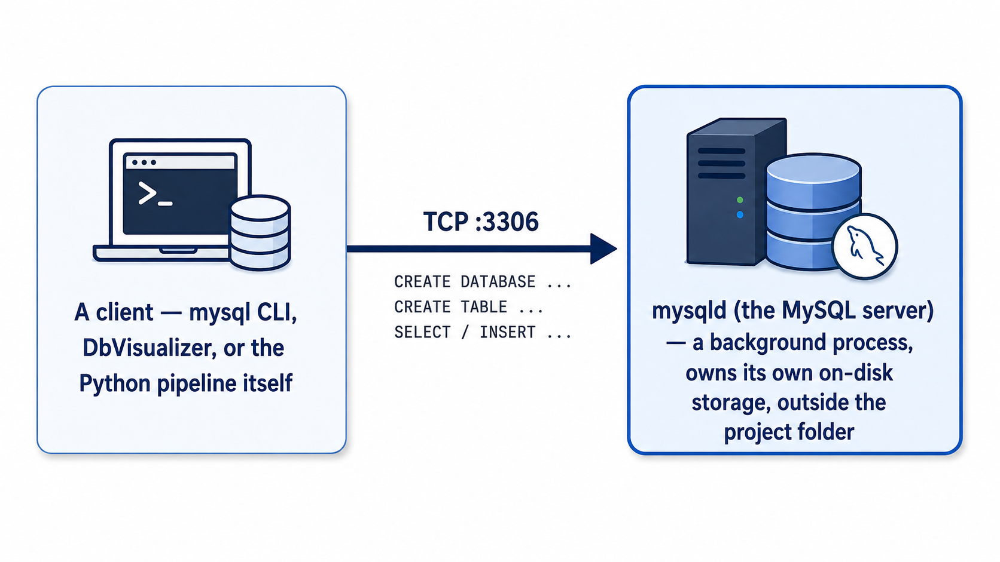
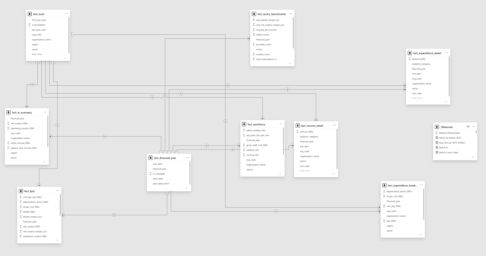

# NHS Trust Financial Analytics — Project Documentation

> Design, architecture, and implementation of an end-to-end financial analytics pipeline built on real
> NHS England data — the business problem, the engineering decisions behind the system, and the findings
> it surfaced.

---

## Table of Contents

**Business Context**

1. [Project Overview](#1-project-overview)
2. [NHS Background and Business Context](#2-nhs-background-and-business-context)
3. [The Financial Crisis in NHS Trusts](#3-the-financial-crisis-in-nhs-trusts)

**The Pipeline, Stage by Stage**

- [The Six-Stage Pipeline](#the-six-stage-pipeline)
- [① NHS England (Source)](#①-nhs-england-source)
- [② Raw Excel Files](#②-raw-excel-files)
- [③ MySQL Staging](#③-mysql-staging)
- [④ MySQL Analytics](#④-mysql-analytics)
- [⑤ CSV Exports](#⑤-csv-exports)
- [⑥ Power BI Dashboard](#⑥-power-bi-dashboard)

**Reference**

- [Technology Stack](#technology-stack)
- [Repository Structure](#repository-structure)
- [Appendix A — Environment Setup and Running the Pipeline](#appendix-a--environment-setup-and-running-the-pipeline)
- [Appendix B — NHS Glossary](#appendix-b--nhs-glossary)

---

## 1. PROJECT OVERVIEW

This is a data engineering and financial analytics portfolio project I built to answer a real-world
question:

> *How is the financial health of NHS Trusts in England changing over time, and which parts of the
> health system are under the most pressure?*

### Business Case

NHS England already publishes the answer to that question — it just doesn't publish it in a form anyone
can use. Trust Accounts Consolidation (TAC) data is released as six separate Excel workbooks a year, each
running to hundreds of thousands of rows in a long/narrow SubCode format designed for archival completeness,
not analysis (full detail in [Section 3](#3-the-financial-crisis-in-nhs-trusts) and
[② Raw Excel Files](#②-raw-excel-files)). There is no consolidated, multi-year, trust-level view anywhere
in the public data as published — building one requires combining six files across three years, resolving
inconsistent formats between them, and pivoting a SubCode taxonomy that isn't self-explanatory without a
data dictionary.

That matters because the underlying numbers describe a sector in genuine distress: the NHS Trust sector
moved from a **£1.6bn surplus to a £1.6bn deficit in two years**, and by 2023/24 **60% of Trusts were
running at a loss**. A finance function — or a board, a regulator, a journalist — trying to understand
*where* that pressure is concentrated (which sector, which region, which cost line) needs exactly the kind
of consolidated, KPI-driven, trend-aware view this project builds: one that didn't previously exist in
ready-to-use form. That gap — real public data, genuine analytical complexity, no existing consolidated
output — is what makes this a credible demonstration of data engineering and financial analytics work,
rather than an exercise against a toy dataset.

### Objectives

1. **Ingest and consolidate** three years of published TAC data — six workbooks, 206 NHS organisations —
   into a single, queryable data warehouse.
2. **Build a reusable, idempotent pipeline** that can absorb a new year's data (or a corrected
   re-publication of an existing year) without manual rework or risk of duplication.
3. **Compute the core NHS financial KPIs** — EBITDA margin, pay % of income, cost per WTE, net surplus
   margin — against NHS England's own published RAG thresholds, not an invented scoring system.
4. **Keep the data model auditable**: every figure in the output should be traceable back to the exact
   source file, TAC schedule, and SubCode it came from.
5. **Deliver the result as an interactive dashboard** usable by a non-technical audience — a finance
   director or board — not just as query output for another analyst.

### Methodology

The approach is standard ETL / dimensional-modelling methodology, adapted to the shape this specific
dataset arrives in:

- **Extract** — source files are downloaded manually (NHS England publishes no API), held as a fixed,
  reproducible snapshot rather than re-fetched on every run.
- **Load (raw)** — data lands in a MySQL staging layer with minimal transformation, preserving exactly
  what NHS England published, so the raw input is always available to audit against.
- **Transform** — staging data is promoted into a conformed star schema: organisation names are resolved
  to ODS codes, and the long/narrow SubCode structure is kept intact rather than pre-pivoted, so no
  financial line item requires a schema change to add.
- **Analyse** — SQL views pivot that star schema into trust-level, year-level tables and compute the KPIs
  and RAG statuses defined above.
- **Report** — the analytics layer is exported to Power BI for interactive, slicer-driven exploration.

Those five methodological steps map directly onto the **six pipeline stages** that make up the rest of
this document — the extract/load split alone accounts for three of them (source, raw files, staging),
because the data physically changes hands three times before any transformation logic runs.
[Section 2](#2-nhs-background-and-business-context) and [Section 3](#3-the-financial-crisis-in-nhs-trusts)
below cover the domain knowledge and the numbers behind the business case;
[The Six-Stage Pipeline](#the-six-stage-pipeline) then walks through the methodology above
as six concrete, code-backed stages, in the order data actually flows through them.

### Outcome

The result is a fully automated analytics pipeline covering **206 NHS organisations** across **three
financial years (2021/22–2023/24)**, with 2.18 million fact rows, surfacing a clear, data-backed account
of the NHS Trust sector's deterioration into collective deficit.

---

## 2. NHS BACKGROUND AND BUSINESS CONTEXT

### What is the NHS?

The **National Health Service (NHS)** is England's publicly funded healthcare system, established in
1948. It provides most healthcare free at the point of use, funded through general taxation. It is one of
the largest employers in the world, with approximately **1.5 million staff**.

### What is an NHS Trust?

NHS healthcare is delivered by organisations called **Trusts**. Each Trust is a legal entity responsible
for running hospitals, ambulance services, mental health services, or community health services within a
defined geography or specialty.

There are two main types:

| Type | What they do | How governed |
|------|-------------|-------------|
| **NHS Trust** | Provide healthcare; not yet achieved Foundation status | Directly overseen by NHS England |
| **NHS Foundation Trust (FT)** | Provide healthcare; earned greater operational autonomy | Overseen by NHS England + NHS Improvement; have members and governors |

Foundation Trust status is a mark of financial and organisational maturity. Most large hospital groups are
Foundation Trusts.

### What sectors do Trusts operate in?

| Sector | Description | Count (2023/24) |
|--------|-------------|----------------|
| **Acute** | General hospitals (A&E, surgery, maternity, cancer) | 118 |
| **Mental Health** | Inpatient and community mental health | 45 |
| **Specialist** | Nationally specialised services (e.g. Great Ormond Street) | 15 |
| **Community** | District nursing, physiotherapy, health visiting | 18 |
| **Ambulance** | Emergency and non-emergency ambulance services | 10 |

### How are NHS Trusts funded?

- **Patient care income** (~82–85% of revenue): NHS England and Integrated Care Boards (ICBs) pay Trusts
  for delivering clinical activity. The main payment mechanism is **Aligned Payment and Incentive (API)**
  contracts — a block payment for expected activity.
- **Other operating income** (~15–18%): Research grants, education and training, non-NHS commercial
  services (e.g. car parking), and charitable funds.

### What do NHS Trusts spend money on?

- **Pay (~65–70% of expenditure)**: Salaries, national insurance, pensions. The NHS workforce is highly
  regulated — pay scales are set nationally (Agenda for Change) and are not easily reduced.
- **Non-pay (~25–30%)**: Clinical supplies, drugs, utilities, estates, clinical negligence premiums (paid
  to NHS Resolution).
- **Depreciation (~5–7%)**: Amortisation of buildings, medical equipment, and IT assets.

### What is financial sustainability for an NHS Trust?

An NHS Trust is financially sustainable if it can cover all its costs from its income. This is measured
by:

- **Operating surplus/deficit** — whether income exceeds expenditure after all running costs
- **EBITDA margin** — earnings before interest, tax, depreciation and amortisation as a % of income; the
  industry standard measure of operational sustainability
- **Net surplus margin** — bottom-line surplus after finance costs and PDC dividends

Regulatory expectations:
- EBITDA margin ≥ 2% = financially sustainable (Green)
- EBITDA margin 0–2% = at risk (Amber)
- EBITDA margin < 0% = in deficit, subject to regulatory intervention (Red)

---

## 3. THE FINANCIAL CRISIS IN NHS TRUSTS

### Why this project matters

The NHS faced severe financial pressure in 2022–2024 due to:

1. **Post-COVID cost base**: COVID-19 left the NHS with increased costs from infection control, backlog
   recovery (extra capacity), and long-term service changes. These costs did not fully unwind.

2. **Inflation surge (2022–2023)**: Energy, clinical supplies, drugs and agency staff costs rose sharply
   with general inflation, at a rate faster than NHS income grew.

3. **Pay awards**: The government agreed above-inflation pay increases (averaging 5–6%) for NHS staff in
   2022/23 and 2023/24, only partially funded by NHS England — leaving Trusts to absorb a gap.

4. **Agency staffing**: Staff shortages drove reliance on expensive agency and bank staff, which carries a
   30–50% price premium over substantive (directly employed) staff.

5. **Clinical negligence premiums**: The NHS Resolution premium (mandatory insurance against clinical
   negligence claims) grew significantly — Trusts cannot control this cost.

### The financial story in numbers

The data in this project quantifies this crisis precisely:

| Year | Total income | Total expenditure | Sector balance | Trusts in deficit |
|------|-------------|-------------------|---------------|-------------------|
| 2021/22 | £110.3bn | £108.7bn | **+£1.6bn surplus** | 37 of 211 (18%) |
| 2022/23 | £118.4bn | £118.2bn | **+£148m surplus** | 85 of 207 (41%) |
| 2023/24 | £129.2bn | £130.8bn | **−£1.6bn deficit** | 124 of 206 (60%) |

In just two years, the NHS Trust sector moved from a **£1.6bn surplus** to a **£1.6bn deficit** — a
**£3.2bn swing**. By 2023/24, **60% of all NHS Trusts were running at a loss**.

---

## THE SIX-STAGE PIPELINE

I designed the system as a **six-stage pipeline**, moving in one direction only — source to dashboard —
where each stage is owned by a different technology and has exactly one job:

<p align="center">

</p>

Each stage below is documented in the order data actually flows through it: what the stage is, why it
exists as its own step rather than being folded into the one before or after it, and the concrete
code/SQL that implements it.

---

## ① NHS ENGLAND (SOURCE)

The origin of every number in this project: NHS England's **Trust Accounts Consolidation (TAC)**
publication — the annual process by which NHS England collects the audited financial accounts of every
NHS Trust and Foundation Trust, consolidates them, and publishes the results. Every NHS Trust submits its
annual accounts in a standardised Excel template to NHS England, which then publishes the consolidated
datasets as public data — the authoritative source of NHS Trust financial data.

**Source:** [NHS England — Trust Accounts Consolidation (TAC)](https://www.england.nhs.uk/financial-accounting-reporting-systems/nhs-england-finance-returns-publications-guidance/trust-accounts-consolidation-tac/)

This stage is entirely external to the system I built — it's the authoritative source of truth I'm
consuming, not producing, and there's no API: downloading requires accepting NHS England's terms of use on
the page itself.

---

## ② RAW EXCEL FILES

`data/raw/` — a local, untouched copy of the six source workbooks (~170MB), pulled down manually since
NHS England doesn't expose an API. This stage exists so every downstream step works from a **fixed,
reproducible snapshot** rather than re-fetching from NHS England on every run — and so I have a stable
point to debug against if a later stage produces a number that looks wrong. Nothing in this stage is
transformed; it's the input held constant.

### How I sourced the data

For each of the three financial years I used (2021/22, 2022/23, 2023/24), NHS England publishes two
files — one for NHS Trusts, one for Foundation Trusts, since the two populations are reported separately.
That's six files in total, saved into `data/raw/` under the exact names the pipeline expects:

```text
data/raw/
  TAC_NHS_trusts_2021-22.xlsx             16MB  —  66 NHS Trusts
  TAC_NHS_foundation_trusts_2021-22.xlsx  33MB  — 140 Foundation Trusts
  TAC_NHS_trusts_2022-23.xlsx             20MB  —  66 NHS Trusts
  TAC_NHS_foundation_trusts_2022-23.xlsx  36MB  — 140 Foundation Trusts
  TAC_NHS_trusts_2023-24.xlsx             18MB  —  66 NHS Trusts
  TAC_NHS_foundation_trusts_2023-24.xlsx  38MB  — 140 Foundation Trusts
```

`data/raw/` is git-ignored — at ~170MB total, these are re-downloadable source files, not something that
belongs in version control (exact filenames listed again in
[Appendix A](#appendix-a--environment-setup-and-running-the-pipeline) if reproducing this locally).

NHS England also publishes a seventh file — `TAC_illustrative_2023-24.xlsx` — a reference schema showing
every SubCode and its description rather than real trust data. I downloaded it too, but the pipeline
explicitly excludes it from ingestion:

```python
files = sorted(
    p for p in RAW_DIR.glob("TAC_NHS_*.xlsx")
    if "illustrative" not in p.name.lower()
)
```

Once a file is on disk, the filename itself is the only place two critical facts live — neither appears
inside the workbook, so this is the first piece of code that runs on each source file, before any sheet is
even opened:

```python
YEAR_RE = re.compile(r"(\d{4})-(\d{2})")

def filename_to_financial_year(filename: str) -> str:
    match = YEAR_RE.search(filename)
    if not match:
        raise ValueError(f"Cannot extract financial year from: {filename}")
    return f"{match.group(1)}/{match.group(2)}"

def filename_to_trust_type(filename: str) -> str:
    return "FOUNDATION_TRUST" if "foundation" in filename.lower() else "NHS_TRUST"
```

`TAC_NHS_trusts_2023-24.xlsx` becomes `financial_year = "2023/24"`, `trust_type = "NHS_TRUST"` — both
values get written onto every row the file produces, all the way through to `fct_tac`. This is also why
the exact filenames matter: rename a file and the pipeline mis-tags every row inside it.

*Deeper notes on the raw file structure and the data-quality quirks I had to handle are written up in
[`notebook/stage_02_raw_excel_files.md`](notebook/stage_02_raw_excel_files.md).*

### What's inside each file

Each file contains multiple sheets. Two sheets matter for this project:

**Sheet 1 — "List of Providers"**: A lookup table mapping each Trust's full legal name to its ODS code,
region, and sector.

| Column | Example |
|--------|---------|
| Full name of Provider | `Barts Health NHS Trust` |
| NHS code | `R1H` |
| Region | `London` |
| Sector | `Acute` |

**Sheet 2 — "All data"**: The actual financial data in **long/narrow format** — every financial line for
every Trust in one table with exactly 7 columns.

| Column | Type | Description | Example |
|--------|------|-------------|---------|
| OrganisationName | Text | Full trust name | `Barts Health NHS Trust` |
| WorkSheetName | Text | TAC schedule (which financial statement) | `TAC02 SoCI` |
| TableID | Integer | Table number within that schedule | `1` |
| MainCode | Text | Column reference encoding year type and table | `A02CY01` |
| RowNumber | Integer | Row position in the original form | `12` |
| SubCode | Text | Unique line item identifier | `SCI0100A` |
| Total | Integer | Value in **£000s** (£ thousands) | `350689` |

### What is a SubCode?

A SubCode is the most granular identifier in the dataset — it uniquely identifies a single financial line
item within a single TAC schedule. For example:

| SubCode | Meaning |
|---------|---------|
| `SCI0100A` | Operating income from patient care activities (TAC02 — the P&L) |
| `SCI0125A` | Total operating expenses (TAC02) |
| `SCI0140A` | Operating surplus/(deficit) (TAC02) |
| `SCI0240` | Net surplus/(deficit) for the year (TAC02) |
| `EXP0130` | Staff and executive directors costs (TAC08 — Expenditure schedule) |
| `EXP0170` | Drugs costs (TAC08) |
| `STA0250` | Total staff costs (TAC09 — Workforce schedule) |
| `STA0410` | Total average WTE (whole-time equivalent headcount) |

For a Trust like Barts Health NHS Trust (`R1H`), in financial year 2023/24, there are approximately
**10,000+ rows** in the "All data" sheet — one for each SubCode across every TAC schedule the workbook
uses. NHS England's own TAC numbering runs to `TAC29`; this project's `dim_worksheet` table ends up with
30 distinct schedule names once real data from all three years is loaded — see
[`notebook/stage_04_mysql_analytics.md`](notebook/stage_04_mysql_analytics.md) for how the schema handles
schedules it didn't pre-seed.

### What is the MainCode convention?

Every row has a MainCode that identifies which column of the original TAC spreadsheet it came from:

```text
Format: A{sheet_number}{CY|PY}{table_number}

Examples:
  A02CY01  →  Sheet TAC02 (SoCI),  Current Year,  Table 1
  A09CY01P →  Sheet TAC09 (Staff), Current Year,  Table 1, Permanent staff column
  A08PY01  →  Sheet TAC08 (OpExp), Prior Year,    Table 1
```

**Important:** Each annual file contains **both Current Year (CY) and Prior Year (PY) data**. The 2023/24
file contains all of 2023/24 (CY) AND all of 2022/23 again (PY) — because the accounts show both years
side by side for comparison. To avoid double-counting when combining 3 years of files, the pipeline keeps
**CY rows only**.

### What TAC schedules are there?

| Schedule | Full Name | Key Data |
|----------|-----------|----------|
| TAC02 SoCI | Statement of Comprehensive Income | Income and expenditure summary (the P&L) |
| TAC03 SoFP | Statement of Financial Position | Balance sheet (assets, liabilities, equity) |
| TAC05 SoCF | Statement of Cash Flows | Cash movements |
| TAC06 Op Inc 1 | Operating Income — Patient Care | Income by activity type and commissioner source |
| TAC07 Op Inc 2 | Operating Income — Other | Research, education, commercial income |
| TAC08 Op Exp | Operating Expenditure | Pay, drugs, supplies, clinical negligence, depreciation |
| TAC09 Staff | Staff Costs and Workforce | Pay by staff group, WTE headcount |
| TAC11 Finance | Finance and Other | Interest, PDC dividends, impairments |
| TAC14 PPE | Property, Plant and Equipment | Fixed assets |
| TAC18 Receivables | Debtors | Money owed to the Trust |
| TAC20 Payables | Creditors | Money the Trust owes |

---

## ③ MYSQL STAGING

`nhs_bronze` — populated by `python/ingestion/load_tac_data.py`. This stage's only job is to get the Excel
data into a queryable form with the *minimum* transformation applied — one row per
(organisation, worksheet, SubCode), essentially as read off the sheet, plus a name-to-ODS-code lookup
table. I deliberately kept this stage "dumb": no joins, no pivoting, no business logic — just a faithful,
query-able landing zone for what NHS England actually published.

### Where this data actually lives

This is worth being explicit about, because it isn't visible anywhere in the repository's file tree:
**MySQL runs as a standalone server process (`mysqld`) with its own on-disk storage, entirely separate
from this project's folder.** The repository contains only the *instructions* for building the database —
the DDL in `sql/schema/create_tables_mysql.sql` — not the database itself. Every component from this stage
onward (the Python scripts, the SQL views, Power BI) talks to that server the same way: as a network
client connecting to `127.0.0.1:3306`.

<p align="center">

</p>

None of `stg_tac_raw`, `dim_trust`, `fct_tac`, or any `v_*` view exists as a file or folder anywhere in
this repo — they exist only inside the running MySQL instance. The only way to inspect them is to connect
a client and query the server directly (`SHOW DATABASES;`, `SHOW TABLES;`, and so on).

I split the MySQL layer into three databases, medallion-style — this raw staging database (`nhs_bronze`),
a conformed dims/fact database (`nhs_silver`), and a curated analytical-views database (`nhs_gold`,
[stage ④](#④-mysql-analytics)) — rather than loading straight into the star schema and mixing tables and
views in one place, all created up front by the same script:

```sql
CREATE DATABASE IF NOT EXISTS nhs_bronze
    CHARACTER SET utf8mb4
    COLLATE utf8mb4_unicode_ci;

CREATE DATABASE IF NOT EXISTS nhs_silver
    CHARACTER SET utf8mb4
    COLLATE utf8mb4_unicode_ci;

CREATE DATABASE IF NOT EXISTS nhs_gold
    CHARACTER SET utf8mb4
    COLLATE utf8mb4_unicode_ci;
```

`nhs_gold`'s views reference `nhs_silver`'s tables via fully-qualified cross-database names
(`FROM nhs_silver.fct_tac`) — MySQL views can query another database on the same server without any
linked-server setup, so the three-way split costs nothing at query time.

### How Python connects to the database

The pipeline is just another client of the MySQL server — it doesn't touch `nhs_bronze` as files, it opens a
network connection to the same `127.0.0.1:3306` endpoint any other client would use:

```python
from sqlalchemy import create_engine

url = f"mysql+pymysql://{DB_USER}:{DB_PASSWORD}@{DB_HOST}:{DB_PORT}/{database}?charset=utf8mb4"
engine = create_engine(url)
```

`load_tac_data.py` hardcodes `DB_USER`/`DB_PASSWORD`/`DB_HOST`/`DB_PORT` at the top of the file rather than
reading them from environment variables — fine for a local portfolio project, but worth calling out as a
known shortcut if asked about production-readiness (see `CLAUDE.md`).

### Getting data from the workbook into staging

For each of the six source files, the pipeline performs four operations to get it into `nhs_bronze`:

**1. Reads the provider list.** Each workbook has a "List of Providers" sheet, which is the only place the
Trust's 3-character ODS code appears — the main data sheet only has the Trust's full name.

```python
df = pd.read_excel(path, sheet_name="List of Providers", header=0)
df = df.rename(columns={"Full name of Provider": "organisation_name", "NHS code": "org_code", ...})
df = df[df["org_code"].str.len() == 3]  # ODS codes are exactly 3 characters
```

**2. Reads the "All data" sheet**, normalising two different column-naming conventions across file
versions (2021/22 used "Organisation Name" with a space; later years use "OrganisationName"), and filters
to Current Year (CY) rows only.

```python
col_map = {
    "Organisation Name": "OrganisationName",   # 2021/22 format
    "Value number":      "Total",               # 2021/22 format
}
df = df.rename(columns=col_map)

df["year_type"] = df["main_code"].apply(lambda c: "PY" if "PY" in str(c) else "CY")
df = df[df["year_type"] == "CY"]
```

**3. Validates** the data before writing anything: no nulls in critical columns
(`organisation_name`, `sub_code`, `total`), no duplicate rows within the file, and every organisation name
resolves against the provider list. A critical failure raises an exception and stops the load before any
write occurs. This is the first of two validation layers I built — see
[the debuggability check in stage ④](#④-mysql-analytics) for the second.

**4. Loads to staging**, using pandas' `to_sql`. Before inserting, existing rows for that year and trust
type are deleted first — a scoped DELETE followed by a bulk INSERT, so re-running the pipeline against the
same file never doubles up rows:

```python
with engine.begin() as conn:
    conn.execute(text(
        "DELETE FROM stg_tac_raw WHERE financial_year = :fy AND trust_type = :tt"
    ), {"fy": financial_year, "tt": trust_type})
    conn.execute(text(
        "DELETE FROM stg_provider_list WHERE financial_year = :fy AND trust_type = :tt"
    ), {"fy": financial_year, "tt": trust_type})

data_df.to_sql("stg_tac_raw", engine, if_exists="append", index=False, chunksize=2000)
```

### Why staging is safe to reload

**Idempotency.** Because the DELETE above is scoped to `(financial_year, trust_type)` and nothing else in
`stg_tac_raw` is touched, staging is disposable and safe to reload per file — this is the simplest form of
idempotency in the pipeline. It's *not* the pattern used for the fact table, though: `fct_tac` accumulates
data across all six files rather than being scoped to one, so it needs a different mechanism, covered in
[stage ④](#④-mysql-analytics).

**Auditability.** `stg_tac_raw` stores the "All data" sheet close to verbatim — no joins, no pivoting, no
derived columns — so any downstream value can be traced back to the exact staging row (and source file) it
came from:

```sql
CREATE TABLE stg_tac_raw (
    id                  BIGINT          NOT NULL AUTO_INCREMENT PRIMARY KEY,
    organisation_name   VARCHAR(300)    NOT NULL,
    worksheet_name      VARCHAR(50)     NOT NULL,
    table_id            SMALLINT        NOT NULL,
    main_code           VARCHAR(20)     NOT NULL,
    row_num             SMALLINT        NOT NULL,
    sub_code            VARCHAR(20)     NOT NULL,
    total               DECIMAL(14,0)   NOT NULL,        -- £000s
    source_file         VARCHAR(200)    NOT NULL,
    trust_type          VARCHAR(20)     NOT NULL,
    financial_year      CHAR(7)         NOT NULL,
    year_type           CHAR(2)         NOT NULL,        -- CY | PY
    load_ts             TIMESTAMP       DEFAULT CURRENT_TIMESTAMP,
    INDEX idx_stg_org_year  (organisation_name(100), financial_year),
    INDEX idx_stg_sub_code  (sub_code),
    INDEX idx_stg_year_type (financial_year, year_type)
) ENGINE=InnoDB;
```

`source_file` and `load_ts` on every row mean I can always answer "which download produced this number,
and when was it loaded" — the one question I'd need answered fast if NHS England ever revised a
prior-year figure.

**Debuggability.** Because staging preserves the source data untouched, if a load looks wrong I can
inspect `stg_tac_raw` to tell whether the fault is in what NHS England published or in the transformation
logic that runs next, in [stage ④](#④-mysql-analytics) — without needing to touch the analytics layer that
Power BI is reading from.

---

## ④ MYSQL ANALYTICS

`nhs_silver` — populated by the same script's `promote_to_fact()` step, which joins staging data against
the provider list to resolve each organisation name to its 3-character ODS code, then UPSERTs the result
into the star schema below, and refreshes `dim_trust`. This is where the raw, EAV-shaped staging data
becomes a conformed, indexed fact table with proper keys. `nhs_gold` sits on top of it, holding only the
SQL views that pivot `nhs_silver.fct_tac` into KPI-ready and statement-shaped output.

### Why the fact table is kept in long/narrow format

NHS England publishes TAC data in **long/narrow (tidy) format** rather than a wide spreadsheet — one row
per financial line item per trust, rather than one column per line item per trust. I kept the warehouse's
fact table in that same shape rather than pre-pivoting it during ingestion, for three reasons: adding a
new financial line requires no schema change, multi-year comparison stays consistent, and SQL aggregation
is straightforward. The trade-off is that every analytical question requires a pivot (filter by SubCode,
aggregate) — which is exactly what the [SQL views](#analytics-layer-sql-views) further down this section
exist to do.

### Promoting staging data into the fact table

**5. Joins to resolve ODS codes and promotes to the fact table.** The "All data" sheet only carries
organisation names, so the pipeline joins staging data against the provider list to attach the
3-character ODS code, then upserts the result into `fct_tac`.

```sql
SELECT p.org_code, r.*
FROM stg_tac_raw r
JOIN stg_provider_list p
    ON r.organisation_name = p.organisation_name
   AND r.financial_year    = p.financial_year
   AND r.trust_type        = p.trust_type
```

**6. Upserts the trust dimension.** `dim_trust` is refreshed from the provider list: new trusts are
inserted, and details for existing trusts (sector, region) are updated if they've changed. The
`first_year_seen` / `last_year_seen` columns track each Trust's tenure in the dataset.

Across all six files, the pipeline runs end-to-end in roughly **10–15 minutes** and leaves the analytics
database at:

```text
dim_trust rows : 215
fct_tac rows   : 2,179,740
```

`dim_trust` (215) and the **206 organisations** cited as this project's headline coverage are two different
counts of the same population, not a contradiction: 215 is every organisation that appears in any of the
six files' provider lists across all three years, while 206 is how many had financial data in the most
recent year, 2023/24 (140 Foundation Trusts + 66 NHS Trusts — the figures behind the sector table in
[Section 2](#2-nhs-background-and-business-context)). The gap is nine organisations that are still listed
as providers in 2023/24 but have no `fct_tac` rows that year — most likely mid-year mergers, where a Trust's
legal identity persists in the provider list before a full annual return exists under a successor code.

### Why fct_tac and dim_trust need UPSERT, not staging's delete-and-reload

`fct_tac` is the single fact table at the centre of the star schema — every financial line item, for every
trust, for every year, from all six source files, sits in this one table. `dim_trust` is the trust
dimension — one row per NHS organisation, holding its name, sector, region, and Foundation Trust status.

Staging's scoped DELETE-then-INSERT doesn't work for either of these tables, because they're not
disposable — they're the *accumulation* of all six files, built up incrementally as the pipeline processes
one file at a time. Walk through what a full run actually does:

1. File 1 (`TAC_NHS_trusts_2021-22.xlsx`) loads and its rows land in `fct_tac`.
2. File 2 (`TAC_NHS_foundation_trusts_2021-22.xlsx`) loads next. If this step started with
   `TRUNCATE fct_tac`, it would delete the rows File 1 just added — the table doesn't belong to File 2, it
   belongs to all six files together.
3. The same problem shows up across separate runs, not just within one: if I re-download an updated
   2023/24 file six months later and rerun the pipeline against just that one file, a truncate-and-reload
   would wipe out the 2021/22 and 2022/23 data that's been sitting in `fct_tac` since earlier runs.

So the requirement is: **each file must be able to add or refresh only its own rows, without touching any
row that belongs to a different file.** That's exactly what an UPSERT does, provided the table has a
unique key that identifies "the same financial line item" regardless of which run loaded it.

### The star schema

I modelled the warehouse as a **star schema** — one fact table surrounded by four dimensions, linked by
three enforced foreign keys on `fct_tac`: `org_code → dim_trust`, `financial_year → dim_financial_year`,
and `worksheet_name → dim_worksheet`.

```sql
CREATE TABLE fct_tac (
    tac_id              BIGINT          NOT NULL AUTO_INCREMENT PRIMARY KEY,
    org_code            CHAR(3)         NOT NULL,   -- which trust (e.g. 'R1H')
    financial_year      CHAR(7)         NOT NULL,   -- which year (e.g. '2023/24')
    worksheet_name      VARCHAR(50)     NOT NULL,   -- which TAC schedule (e.g. 'TAC02 SoCI')
    table_id            SMALLINT        NOT NULL,
    main_code           VARCHAR(20)     NOT NULL,   -- which column of the original TAC form
    sub_code            VARCHAR(20)     NOT NULL,   -- which specific line item (e.g. 'SCI0100A')
    total_000s          DECIMAL(14,0)   NOT NULL,   -- the value, in £000s
    trust_type          VARCHAR(20)     NOT NULL,
    source_file         VARCHAR(200)    NOT NULL,   -- which of the 6 files this row came from
    load_ts             TIMESTAMP       DEFAULT CURRENT_TIMESTAMP,
    UNIQUE KEY uq_tac (org_code, financial_year, main_code, sub_code),
    INDEX idx_fct_org_year  (org_code, financial_year),
    INDEX idx_fct_sub_code  (sub_code),
    INDEX idx_fct_worksheet (worksheet_name),
    INDEX idx_fct_year      (financial_year),
    FOREIGN KEY (org_code)       REFERENCES dim_trust(org_code),
    FOREIGN KEY (financial_year) REFERENCES dim_financial_year(financial_year),
    FOREIGN KEY (worksheet_name) REFERENCES dim_worksheet(worksheet_name)
) ENGINE=InnoDB;
```

`UNIQUE KEY uq_tac (org_code, financial_year, main_code, sub_code)` is the piece doing the work: it says
"this trust, this year, this exact line item" can only exist as one row. Every file only ever produces
rows for its own `(financial_year, trust_type)`, so its rows can never collide with another file's rows
under this key — which is what makes the promotion step safe to run file-by-file:

```sql
INSERT INTO fct_tac
    (org_code, financial_year, worksheet_name, table_id,
     main_code, sub_code, total_000s, trust_type, source_file)
VALUES
    (:org_code, :financial_year, :worksheet_name, :table_id,
     :main_code, :sub_code, :total_000s, :trust_type, :source_file)
ON DUPLICATE KEY UPDATE
    total_000s  = VALUES(total_000s),
    source_file = VALUES(source_file),
    load_ts     = CURRENT_TIMESTAMP;
```

Read as plain English: for each staging row, try to insert it as a new fact; if a row with that exact
`(org_code, financial_year, main_code, sub_code)` already exists — because this file was loaded before —
overwrite its value, source file, and load timestamp instead of inserting a duplicate. Every other row in
`fct_tac`, belonging to every other file, is untouched by this statement.

`dim_trust` faces the identical problem — the provider list is re-read from every file, so the same trust
appears up to six times across a full run — and gets the identical fix, upserted rather than reinserted
wholesale:

```sql
INSERT INTO dim_trust
    (org_code, organisation_name, trust_type, sector, region, is_foundation,
     first_year_seen, last_year_seen)
VALUES
    (:org_code, :organisation_name, :trust_type, :sector, :region, :is_foundation,
     :financial_year, :financial_year)
ON DUPLICATE KEY UPDATE
    last_year_seen = VALUES(last_year_seen),
    sector         = COALESCE(VALUES(sector), sector),
    region         = COALESCE(VALUES(region), region),
    updated_ts     = CURRENT_TIMESTAMP;
```

Here the unique key is just `org_code` (`dim_trust`'s primary key) — a trust is a trust regardless of
which year's file mentioned it. The `ON DUPLICATE KEY UPDATE` clause is deliberately selective about what
it overwrites: `last_year_seen` always moves forward to the year currently being loaded, but
`first_year_seen` is never listed, so it's set once (on the trust's very first appearance) and never
touched again on subsequent loads — it's the pipeline's record of when each trust first entered the
dataset.

Running `load_tac_data.py` twice against the same file leaves `fct_tac` and `dim_trust` with identical row
counts both times — nothing duplicates, and nothing from any other file is affected.

As a concrete example, once the data is loaded, a trust's patient care income for a given year is a single
lookup:

```sql
SELECT total_000s
FROM fct_tac
WHERE org_code        = 'R1H'
  AND financial_year  = '2023/24'
  AND sub_code        = 'SCI0100A';  -- Patient care income line in TAC02
-- Returns: 2,047,000  (i.e. £2.047bn)
```

The [analytical views](#analytics-layer-sql-views) below perform this same lookup — pivoted across all 206
Trusts and all key SubCodes at once — rather than requiring it to be written by hand for every question.

### Fixing a gap between the schema script and the live database

`sql/schema/create_tables_mysql.sql` had always declared the third foreign key above
(`worksheet_name → dim_worksheet`), but the deployed table was missing it — a drift between the script and
what had actually been built. I checked for orphaned values first (any `fct_tac.worksheet_name` with no
matching row in `dim_worksheet` would have made the constraint impossible to add), confirmed there were
none, and added it directly:

```sql
ALTER TABLE fct_tac
  ADD CONSTRAINT fct_tac_ibfk_3
  FOREIGN KEY (worksheet_name) REFERENCES dim_worksheet(worksheet_name);
```

`SHOW CREATE TABLE fct_tac` now lists all three constraints, so the live schema matches the script:

```sql
CONSTRAINT `fct_tac_ibfk_1` FOREIGN KEY (`org_code`)       REFERENCES `dim_trust` (`org_code`),
CONSTRAINT `fct_tac_ibfk_2` FOREIGN KEY (`financial_year`) REFERENCES `dim_financial_year` (`financial_year`),
CONSTRAINT `fct_tac_ibfk_3` FOREIGN KEY (`worksheet_name`) REFERENCES `dim_worksheet` (`worksheet_name`)
```

`sub_code` remains deliberately unconstrained on `fct_tac`, and that one *is* by design rather than drift:
the fact table joins to `dim_subcode` on `sub_code`, and `dim_subcode` itself carries the FK into
`dim_worksheet` (every SubCode belongs to exactly one TAC schedule). Adding a direct `sub_code` FK on
`fct_tac` as well would just duplicate a constraint that's already correctly enforced one join away, on a
table 2.18 million rows smaller. `worksheet_name` is still a real, meaningful column on `fct_tac` — every
row carries the name of the TAC schedule it came from — it's just a deliberately denormalized copy of the
same attribute that's canonically enforced on `dim_subcode`, kept on the fact table so a query can filter
or group 2.18 million rows by schedule without an extra join.

This is the ERD re-exported from DbVisualizer after adding the constraint — `fct_tac` now shows all three
arrows (`org_code`, `financial_year`, `worksheet_name`), and `dim_subcode.worksheet_name`'s separate arrow
into `dim_worksheet` is unchanged:

<p align="center">

</p>

`fct_tac` is the central table: **2,179,740 rows**, one row per SubCode value, per Trust, per year.

| Column | Type | Description |
|--------|------|-------------|
| `org_code` | CHAR(3) | ODS code (e.g. `R1H` for Barts) |
| `financial_year` | CHAR(7) | e.g. `2023/24` |
| `worksheet_name` | VARCHAR | e.g. `TAC02 SoCI` |
| `main_code` | VARCHAR | e.g. `A02CY01` |
| `sub_code` | VARCHAR | e.g. `SCI0100A` |
| `total_000s` | DECIMAL | Value in £000s |
| `trust_type` | VARCHAR | `NHS_TRUST` or `FOUNDATION_TRUST` |

### Validating the loaded data

I built two layers of validation into the pipeline rather than trusting the source files blindly. The
first — in-pipeline checks inside `load_tac_data.py` — runs before any write, in
[stage ③](#③-mysql-staging). The second runs here, after the promotion above:

**Post-load checks**, in `sql/views/v_validation_checks.sql` (mirrored in
`python/transformation/validate_tac_data.py`, which writes results to
`data/processed/validation_report.csv`) — ten queries against the fully loaded warehouse, each carrying an
inline expected-value comment. The three I treat as the load's pass/fail signal:

- Patient care income should total £99.8bn in 2021/22, rising to £117.9bn by 2023/24
- Roughly 60% of trusts should show a deficit in 2023/24
- `total_rows` should equal `unique_keys` on `fct_tac` — confirms no duplicate loading occurred

If a load looks wrong, the first check is comparing loaded row counts against the known shape of the data
— one of the ten queries above:

```sql
SELECT financial_year,
       trust_type,
       COUNT(DISTINCT org_code)  AS providers,
       FORMAT(COUNT(*), 0)       AS total_rows
FROM fct_tac
GROUP BY financial_year, trust_type
ORDER BY financial_year, trust_type;
-- Expected: 140-145 FTs, 66-70 NHS Trusts per year
```

If a year comes back short, or a trust count looks too low, I know to check `stg_tac_raw` (stage ③) for
that `(financial_year, trust_type)` before suspecting the promotion logic — the fault is either in what NHS
England published or in how the pipeline joined it, and staging tells me which, without touching the
analytics layer that Power BI is reading from.

### Analytics layer (SQL views)

`fct_tac` is correct once loaded, but it's still shaped as 2.18 million individual SubCode rows — not
something a dashboard can chart directly. I built seven SQL views on top of it that pivot SubCodes into
columns, turning the long/narrow fact data into trust-level, year-level analytical tables. `fct_tac` itself
already carries all 28 real TAC worksheets (`promote_to_fact()` has no worksheet filter), so a new view
only ever needs a new `MAX(CASE WHEN sub_code = ...)` pivot, not a change to ingestion.

**v_income_expenditure** — pivots the 5 core TAC02 SoCI (Statement of Comprehensive Income) SubCodes into
an I&E summary row per Trust per year. Kept deliberately summary-only, since `v_kpis` and
`v_trust_annual_scorecard` depend on its shape.

```sql
MAX(CASE WHEN sub_code = 'SCI0100A' THEN total_000s END)  AS patient_care_income_000s
MAX(CASE WHEN sub_code = 'SCI0110A' THEN total_000s END)  AS other_income_000s
MAX(CASE WHEN sub_code = 'SCI0140A' THEN total_000s END)  AS operating_surplus_000s
MAX(CASE WHEN sub_code = 'SCI0240'  THEN total_000s END)  AS net_surplus_000s
```

Output: 624 rows (208 average trusts × 3 years).

**v_profit_and_loss** — the full-detail counterpart: every real TAC02 SoCI/SOC line (~27 columns) down to
`total_comprehensive_income_000s`, for a proper statutory P&L rather than a KPI summary.

**v_expenditure_breakdown** — pivots TAC08 Operating Expenditure SubCodes, using
`dim_subcode.analytics_category` to group lines into Pay, Non-Pay, and Depreciation/Amortisation buckets.

```sql
SUM(CASE WHEN sc.analytics_category = 'PAY'    THEN total_000s END)  AS pay_000s
SUM(CASE WHEN sc.analytics_category = 'NON_PAY' THEN total_000s END) AS non_pay_000s
```

**v_workforce** — pivots TAC09 Staff SubCodes into staff cost and WTE columns per Trust per year.

**v_balance_sheet** — the Statement of Financial Position counterpart to `v_profit_and_loss`: all 40 real
TAC03 SoFP `BAL*` lines (non-current/current assets and liabilities down to total equity). Until this view
existed, TAC03 SoFP rows sat in `fct_tac` unused — the raw data always had them, nothing pivoted them.
Unlike SoCI/EXP, this schedule stores correctly signed values already (liabilities negative), so the pivot
needs no sign-flipping.

**v_kpis** — joins `v_income_expenditure`, `v_expenditure_breakdown`, and `v_workforce`, and computes the
derived KPIs defined in full below.

```sql
-- EBITDA = Operating surplus + depreciation/amortisation
operating_surplus_000s + COALESCE(depreciation_amort_000s, 0) AS ebitda_000s

-- EBITDA margin as a % of total income
ROUND(ebitda_000s / NULLIF(total_income_000s, 0) * 100, 1) AS ebitda_margin_pct

-- Pay as % of income
ROUND(pay_000s / NULLIF(total_income_000s, 0) * 100, 1) AS pay_pct_income

-- Cost per WTE (£000s per WTE)
ROUND(staff_cost_000s / NULLIF(total_wte, 0), 1) AS cost_per_wte_000s
```

**v_trust_annual_scorecard** — a wide, one-row-per-trust-per-year view combining every metric from the
four views above, built for DirectQuery and ad-hoc SQL work rather than the CSV export: it's what
`transform_tac_data.py` and `validate_tac_data.py` query in [stage ④](#④-mysql-analytics), and what the
standalone queries in `sql/analysis/` are built on. [Stage ⑤](#⑤-csv-exports)'s CSV export doesn't use it —
it queries `v_income_expenditure`, `v_expenditure_breakdown`, `v_workforce`, and `v_kpis` separately instead,
because Power BI's own model does the joining once each table is imported, so a pre-joined wide view would
just be flattened straight back out again on import.

```sql
CASE WHEN ebitda_margin_pct < 2  THEN 'Red'
     WHEN ebitda_margin_pct < 5  THEN 'Amber'
     ELSE 'Green' END AS ebitda_rag,

CASE WHEN operating_surplus_000s < 0 THEN 1 ELSE 0 END AS is_deficit
```

### Key Performance Indicators (KPIs)

`v_kpis` computes four core financial health metrics — used throughout the NHS and central to this
project's analysis:

**EBITDA Margin %** — Operational profitability: how much of every pound of income is left after paying
staff and non-pay running costs, before accounting for interest, tax, depreciation and amortisation.
Depreciation is a non-cash charge, so EBITDA strips it out to give a cleaner view of operational cashflow
generation — the standard NHS sustainability metric.

```text
EBITDA = Operating Surplus + Depreciation + Amortisation

EBITDA Margin % = EBITDA / Total Income × 100
```

| RAG | Threshold | Meaning |
|-----|-----------|---------|
| Green | ≥ 5% | Strong financial position |
| Amber | 2–5% | Financially fragile |
| Red | < 2% | Unsustainable; regulatory risk |

**2023/24 average by sector:**
- Specialist: 4.7% (best performing)
- Community: 4.9%
- Ambulance: 4.2%
- Mental Health: 3.5%
- Acute: 3.3% (largest sector, under most pressure)

**Pay as % of Income** — How much of total income is consumed by staff costs. In the NHS, workforce is
the largest cost driver and the least controllable (national pay scales, shortage specialties, agency
dependency).

```text
Pay % = Total Pay Costs / Total Income × 100
```

Benchmarks: Acute ~60–65% (lower, high income from activity); Ambulance/Community/Mental Health 70–75%
(more labour-intensive models).

**Net Surplus Margin %** — The bottom line: surplus/(deficit) as a % of income after ALL costs including
finance charges and PDC dividends.

```text
Net Surplus Margin % = Net Surplus (Deficit) / Total Income × 100
```

In 2023/24, the acute sector averaged **-5.2% net surplus margin** — meaning for every £100 of income,
acute Trusts spent £105.20.

**Cost per WTE (£000s)** — Average cost per whole-time equivalent member of staff, useful for benchmarking
staff cost efficiency across Trusts of different sizes.

```text
Cost per WTE = Total Staff Costs / Total WTE
```

A higher cost per WTE may reflect: more senior staff mix, London weighting, or agency staff premium.

**Other KPIs available in the dataset:**

| KPI | Description |
|-----|-------------|
| Private patient income % | Commercial revenue as % of total (typically 1–5%) |
| Drugs cost % | High cost drugs as % of income (important for specialist Trusts) |
| Clinical negligence % | NHS Resolution premium as % of income (growing cost pressure) |
| Finance income vs expense | Net finance position (capital structure) |

### Key findings

With the KPIs computed across all 206 trusts and 3 years, here's what the data actually shows.

**Finding 1 — The NHS sector tipped into collective deficit in 2023/24.** The most striking finding is the
scale and speed of the financial deterioration:

```text
2021/22  →  +£1,600m surplus  (18% of trusts in deficit)
2022/23  →  +£148m surplus    (41% of trusts in deficit)
2023/24  →  −£1,634m deficit  (60% of trusts in deficit)
```

This is not a gradual decline — it is a sharp deterioration driven by inflation and pay pressures that
outpaced income growth.

**Finding 2 — Income is growing, but expenditure is growing faster.**

| Metric | 2021/22 | 2023/24 | Growth |
|--------|---------|---------|--------|
| Income | £110.3bn | £129.2bn | +17.1% |
| Expenditure | £108.7bn | £130.8bn | +20.3% |

Expenditure grew 3.2 percentage points faster than income over 2 years.

**Finding 3 — The acute sector carries the highest absolute pressure.** Acute Trusts represent **76% of
NHS income** (£98bn of £129bn in 2023/24) and account for **74 of the 124 deficit Trusts**. Their average
EBITDA margin fell from 4.8% to 3.3%.

**Finding 4 — Specialist Trusts are the most financially resilient.** Specialist Trusts (Great Ormond
Street, Royal Marsden, etc.) maintained the highest EBITDA margin (4.7% in 2023/24), the lowest pay % of
income (55.2% — more non-pay clinical costs like high-cost drugs), and only 6 of 15 in deficit. Their
income model (nationally commissioned, highly specialised, less exposed to block contract reductions)
provides more stability.

**Finding 5 — Mental Health saw the sharpest relative deterioration.** Mental Health Trusts had the worst
net surplus margin in 2023/24 at **-2.4%** on average, and 28 of 45 (62%) in deficit. Their workforce is
almost entirely pay (70.6% of income), giving very little headroom to absorb cost pressures.

**Finding 6 — Pay pressure is sector-wide.** Across all sectors, pay costs as a % of income remained
elevated at 65–72% — substantially above pre-COVID norms. The 2022 and 2023 pay awards added c.5–6% to the
national pay bill in each year, with NHS England funding only approximately 60–70% of the cost centrally.

---

## ⑤ CSV EXPORTS

`data/processed/powerbi_export/` — populated by `python/reporting/export_for_powerbi.py`, which queries
the views and tables in [stage ④](#④-mysql-analytics) and writes eleven CSV files in roughly 30 seconds.
Portability is this stage's job: it turns a live database dependency into a set of flat files that Power
BI (or any other tool, or a reviewer with no MySQL access) can consume without a database connection at
all. Power BI can alternatively connect directly to MySQL in DirectQuery mode — the views were designed to
support that too.

### Two implementation details that shape every file

**Excel-safe encoding.** Every file is written with `df.to_csv(out_path, index=False,
encoding="utf-8-sig")` — the `-sig` variant prepends a UTF-8 byte-order mark. Without it, Excel (and Power
BI's CSV connector, which shares Excel's parser on Windows) misreads the `£` symbol in column values and
in any narrative text. This bit me once during testing and is now standard on every export.

**Clean numeric output.** Every `_000s` column is wrapped in `CAST(... AS SIGNED)` in the SQL itself,
rather than left as MySQL's native `DECIMAL(14,0)`. Pandas reads unwrapped `DECIMAL` columns as Python
`Decimal` objects, which write to CSV with inconsistent formatting; casting to a signed integer in SQL
guarantees plain, Power-BI-friendly numbers in the output file.

### All eleven files, and what's in each one

| File | Role | Source | Grain | Columns | Rows |
|------|------|--------|-------|---------|------|
| `dim_trust.csv` | Trust slicer | `dim_trust` table | One row per trust | 8 | 215 |
| `dim_financial_year.csv` | Year slicer | `dim_financial_year` table | One row per financial year | 5 | 5 |
| `ie_summary.csv` | Income statement (I&E) | `v_income_expenditure` | One row per trust per year | 12 | 624 |
| `expenditure_breakdown.csv` | Cost category split | `v_expenditure_breakdown` | One row per trust per year | 12 | 624 |
| `workforce.csv` | Staffing and cost | `v_workforce` | One row per trust per year | 14 | 624 |
| `kpis.csv` | KPI scorecard | `v_kpis` | One row per trust per year | 19 | 624 |
| `income_detail.csv` | Income drilldown | `fct_tac` + `dim_subcode`, filtered | One row per trust per year per income SubCode | 9 | 9,144 |
| `expenditure_detail.csv` | Expenditure drilldown | `fct_tac` + `dim_subcode`, filtered | One row per trust per year per expenditure SubCode | 9 | 11,856 |
| `profit_and_loss.csv` | Full statutory P&L | `v_profit_and_loss` | One row per trust per year | ~27 | ~624 |
| `balance_sheet.csv` | Full statutory Balance Sheet | `v_balance_sheet` | One row per trust per year | 40 | ~624 |
| `sector_benchmarks.csv` | Sector benchmarking (aggregated) | `v_kpis`, aggregated | One row per financial year per sector per trust type | 12 | 30 |

`dim_trust.csv` is the join key every other file relies on — all ten remaining files carry `org_code`
and join back to it. `income_detail.csv` and `expenditure_detail.csv` are the only two not built from a
pre-aggregated view: both query `fct_tac` directly, joined to `dim_trust` and `dim_subcode`, filtered to
Current Year rows and non-subtotal SubCodes — one row per line item rather than one row per trust.
`sector_benchmarks.csv` is the one file that departs from the project's usual £000s convention: its
totals are computed in £millions, since sector-level sums in £000s run to eight figures and stop being
readable on a benchmarking chart.

### The star schema once these eleven files reach Power BI

Each CSV lands in Power BI as its own table (`fact_ie_summary`, `fact_kpis`, `fact_workforce`,
`fact_income_detail`, `fact_expenditure_detail`, `fact_expenditure_breakdown`, `fact_profit_and_loss`,
`fact_balance_sheet`, `fact_sector_benchmarks`, plus `dim_trust` and `dim_financial_year`), and Power
Query's own model view redraws the same star shape described in [stage ④](#④-mysql-analytics) — every
fact table radiating out from the two shared dimensions, joined on `org_code` and `financial_year`, the
same pattern documented in `power_bi/setup_guide.md`.

The screenshot below predates `fact_profit_and_loss`/`fact_balance_sheet` (added later, following the
identical relationship pattern already shown here) and shows the seven fact tables that existed when it
was taken:

<p align="center">

</p>

The `_Measures` table on the right isn't a data table at all — it's an empty table I created purely to
hold the DAX measures listed below, so they have a home that isn't attached to any one fact table.

### DAX measures

DAX (Data Analysis Expressions) computes values dynamically based on the current filter context. Every
measure lives in the `_Measures` table shown in the model-view screenshot above — an otherwise-empty
table that exists purely to hold calculations. There are **51 measures** in total, listed below by name;
the full `createOrReplace` definition — every formula, format string, and lineage tag, exported straight
from Power BI Desktop's TMDL view — lives at
[`power_bi/dax/_Measures.tmdl`](power_bi/dax/_Measures.tmdl).

| Measure | Measure | Measure | Measure | Measure |
|---------|---------|---------|---------|---------|
| Total Income (£m) | Patient Care Income (£m) | Other Income (£m) | Total Expenditure (£m) | Operating Surplus (£m) |
| Net Surplus (£m) | Total Pay (£m) | Total Non-Pay (£m) | Depreciation & Amortisation (£m) | Drugs Cost (£m) |
| EBITDA (£m) | EBITDA Margin % | Pay % of Income | Net Surplus Margin % | Deficit Trusts |
| Surplus Trusts | Total Trusts | Deficit % | Total WTE | Total Staff Cost (£m) |
| Avg Cost per WTE (£000s) | Medical WTE | Nursing WTE | Admin & Estates WTE | Scientific & Tech WTE |
| Medical % of WTE | Nursing % of WTE | Prior Year | Prior Year Income (£m) | Income YoY Growth % |
| Prior Year EBITDA Margin % | EBITDA Margin YoY pp | Prior Year Pay % | Pay % YoY pp | Prior Year Deficit Trusts |
| Deficit Trusts YoY Change | EBITDA RAG | Surplus RAG | Pay RAG | EBITDA RAG Colour |
| Surplus RAG Colour | Pay RAG Colour | Selected Year | Selected Sector | Selected Region |
| Page Title - I&E | Surplus Label | EBITDA Label | Deficit Count Label | Sector Benchmark EBITDA % |
| EBITDA vs Sector Benchmark pp | | | | |

`power_bi/dax_measures.md` was the measure *plan* written before the dashboard was built and refers to
tables as `ie_summary`, `kpis`, etc.; the `_Measures` table above is the as-built version, referring to
`fact_ie_summary`, `fact_kpis`, and so on — the `fact_`/`dim_` prefixes Power BI's model view assigns once
each CSV is imported as its own table. Full model relationships and per-page visual specs are documented
in `power_bi/setup_guide.md`.

---

## ⑥ POWER BI DASHBOARD

Imports the stage-⑤ CSVs (or, alternatively, connects directly to stage ④ via DirectQuery), applies the
model relationships and DAX measures from [stage ⑤](#⑤-csv-exports), and renders the five report pages
below. This is the only stage a non-technical end user — a finance director, a board — actually interacts
with; every stage before it exists to get data into a shape this one can present. Microsoft Power BI is
the standard reporting tool in NHS finance departments.

`dim_trust[sector]`, `dim_trust[region]`, and `dim_financial_year[financial_year]` are placed as slicers
on every page, filtering all of that page's visuals simultaneously.

### Report pages

I designed five report pages:

| Page | Purpose |
|------|---------|
| **Executive Summary** | KPI cards, sector breakdown, deficit/surplus donut, 3-year trend lines |
| **Income & Expenditure** | Waterfall bridge, trust-level matrix, scatter plots |
| **Expenditure Detail** | Pay vs non-pay breakdown, drugs costs, clinical negligence trend |
| **Benchmarking** | EBITDA distribution, top/bottom performers, peer comparison table |
| **Workforce** | WTE trends, cost per WTE, staff cost as % of income |

---

## TECHNOLOGY STACK

| Layer | Technology | Why |
|-------|-----------|-----|
| Source data | NHS England TAC publications (Excel) | Authoritative public source of audited NHS Trust accounts |
| Ingestion | Python 3.11, pandas, openpyxl | Reads and reshapes large, multi-sheet Excel workbooks |
| Database connectivity | SQLAlchemy, PyMySQL | Client library connecting Python to MySQL over the network |
| Data warehouse | MySQL 8.0 | Two-database staging/analytics pattern, star schema |
| Analytics | SQL (views) | Pivots long/narrow fact data, computes KPIs and RAG flags |
| Reporting | Power BI, DAX | Interactive dashboard for a finance-analytics audience |

Python dependencies: `pandas`, `sqlalchemy`, `pymysql`, `openpyxl` — installed directly; no
`requirements.txt` is checked in. There is no automated test suite or linter configured for this project.

---

## REPOSITORY STRUCTURE

```text
portfolio-01-nhs-trust-financial-analytics/
│
├── README.md                          ← Quick-start summary
├── PROJECT_DOCUMENTATION.md           ← This file
├── CLAUDE.md                          ← AI coding assistant instructions; real architecture reference
│
├── agent_docs/                        ← Domain knowledge reference (see note under stage ④ re: scope)
│   ├── data_dictionary.md             ← TAC columns and SubCode reference
│   ├── kpi_definitions.md             ← KPI formulas and RAG thresholds
│   └── report_calendar.md             ← NHS period table and reporting cycle
│
├── data/                              ← git-ignored; regenerated by the pipeline, not committed
│   ├── raw/                           ← Source NHS Excel files — stage ②
│   │   ├── TAC_NHS_trusts_2021-22.xlsx
│   │   ├── TAC_NHS_foundation_trusts_2021-22.xlsx
│   │   ├── TAC_NHS_trusts_2022-23.xlsx
│   │   ├── TAC_NHS_foundation_trusts_2022-23.xlsx
│   │   ├── TAC_NHS_trusts_2023-24.xlsx
│   │   └── TAC_NHS_foundation_trusts_2023-24.xlsx
│   └── processed/
│       ├── validation_report.csv      ← Output of validate_tac_data.py — stage ④
│       └── powerbi_export/            ← Nine CSV files for Power BI — stage ⑤
│           ├── dim_trust.csv
│           ├── dim_financial_year.csv
│           ├── ie_summary.csv
│           ├── expenditure_breakdown.csv
│           ├── workforce.csv
│           ├── kpis.csv
│           ├── income_detail.csv
│           ├── expenditure_detail.csv
│           └── sector_benchmarks.csv
│
├── docs/
│   └── images/                        ← Screenshots and diagrams embedded in this document
│       ├── pipeline_architecture.png
│       ├── mysql_client_server.png
│       ├── star_schema.png
│       └── powerbi_model.png
│
├── python/
│   ├── CLAUDE.md                      ← Python layer coding standards
│   ├── ingestion/
│   │   ├── load_tac_data.py           ← Main ingestion script — stages ③④
│   │   └── build_subcode_reference.py ← One-off dim_subcode label generator (not in the daily pipeline)
│   ├── transformation/                ← Enrichment and validation — stage ④
│   │   ├── transform_tac_data.py
│   │   └── validate_tac_data.py
│   └── reporting/
│       └── export_for_powerbi.py      ← CSV export script — stage ⑤
│
├── sql/
│   ├── CLAUDE.md                      ← SQL layer coding standards
│   ├── schema/
│   │   ├── create_tables_mysql.sql    ← Full schema: staging + dims + fact + views — stages ③④
│   │   └── create_tables.sql          ← PostgreSQL equivalent (reference)
│   ├── views/                         ← Standalone, canonical version of each v_* view — stage ④
│   │   ├── v_income_expenditure.sql
│   │   ├── v_profit_and_loss.sql      ← Full statutory P&L (all real TAC02 SoCI/SOC lines)
│   │   ├── v_expenditure_breakdown.sql
│   │   ├── v_workforce.sql
│   │   ├── v_balance_sheet.sql        ← Full statutory Balance Sheet (all 40 TAC03 SoFP BAL* lines)
│   │   ├── v_kpis.sql
│   │   ├── v_trust_annual_scorecard.sql
│   │   └── v_validation_checks.sql    ← 10 data quality checks with expected values
│   └── analysis/                      ← Standalone, presentation-ready analytical queries
│       ├── sector_trend_analysis.sql
│       └── benchmarking_analysis.sql
│
├── power_bi/
│   ├── CLAUDE.md                      ← Power BI coding standards
│   ├── setup_guide.md                 ← Model relationships, DAX, page specs — stage ⑥
│   ├── dax_measures.md                ← All 51 measures, human-readable — stage ⑥
│   └── dax/
│       └── _Measures.tmdl             ← Exact createOrReplace export from Power BI Desktop
│
├── reports/
│   ├── CLAUDE.md                      ← Report narrative standards (FReM)
│   └── nhs_sector_financial_review_2324.md ← Annual sector outturn narrative built on this data
│
└── notebook/                           ← Stage-by-stage build notes kept while developing the pipeline
    ├── stage_01_nhs_england_source.md
    ├── stage_02_raw_excel_files.md
    ├── stage_03_mysql_staging.md
    ├── stage_04_mysql_analytics.md
    ├── stage_05_csv_exports.md
    └── stage_06_powerbi_dashboard.md
```

---

## APPENDIX A — ENVIRONMENT SETUP AND RUNNING THE PIPELINE

The steps below are for reproducing this project locally — building it once and reading the sections
above is the point of this document; this appendix exists for reference, not as the main narrative.

**Prerequisites**

| Tool | Version |
|------|---------|
| Python | 3.11+ |
| MySQL | 8.0+ |

```bash
pip install pandas sqlalchemy pymysql openpyxl
```

**Steps**

1. Download the six TAC Excel files from NHS England's TAC publications page and save them to `data/raw/`
   using the exact filenames listed in [stage ②](#②-raw-excel-files).
2. Build the schema: `mysql -u root -p < sql/schema/create_tables_mysql.sql` — creates all three databases,
   all tables, seed reference data, and the seven core views. Expected: 3 databases, 7 tables, 7 views,
   ~1,033 seed rows (5 financial years, 28 worksheets, ~1,000 SubCode labels).
3. Run the ingestion pipeline: `python python/ingestion/load_tac_data.py` (~10–15 minutes for all 6
   files).
4. Validate the load: run `sql/views/v_validation_checks.sql`, or
   `python python/transformation/validate_tac_data.py`.
5. Export for Power BI: `python python/reporting/export_for_powerbi.py` (~30 seconds).
6. Open Power BI Desktop, import the eleven CSVs from `data/processed/powerbi_export/`, and follow
   `power_bi/setup_guide.md` to build the relationships, measures, and report pages.

`data/raw/` and `data/processed/` are both git-ignored — neither is present in a fresh clone of the
repository.

---

## APPENDIX B — NHS GLOSSARY

| Term | Definition |
|------|-----------|
| **Agenda for Change (AfC)** | The national pay framework for NHS staff (Bands 1–9). Most clinical and administrative staff are on AfC. |
| **API** | Aligned Payment and Incentive — the NHS contract mechanism under which commissioners pay Trusts. Replaced PbR from 2021/22. |
| **CIP** | Cost Improvement Programme — an NHS Trust's annual efficiency savings plan, typically 2–5% of expenditure. |
| **Commissioner** | An organisation that buys (commissions) NHS services. Mainly ICBs (formerly CCGs) and NHS England for specialised services. |
| **EBITDA** | Earnings Before Interest, Tax, Depreciation and Amortisation. The standard NHS operational sustainability measure. |
| **FReM** | Financial Reporting Manual — the UK government accounting standards that NHS Trusts must follow (based on IFRS). |
| **FT** | Foundation Trust — an NHS Trust that has earned greater operational and financial autonomy. |
| **ICB** | Integrated Care Board — replaced Clinical Commissioning Groups (CCGs) from July 2022. Commissions most NHS services locally. |
| **IFRS** | International Financial Reporting Standards — the accounting framework adopted by NHS Trusts from 2009. |
| **NHS Resolution** | The arm's-length body that manages clinical negligence claims against the NHS. Trusts pay an annual premium. |
| **ODS code** | Organisation Data Service code — a 3-character alphanumeric code uniquely identifying each NHS organisation (e.g. `R1H` = Barts Health). |
| **PDC dividend** | Public Dividend Capital dividend — a return paid by NHS Trusts to the government on publicly funded assets (similar to a cost of capital charge). |
| **PFI** | Private Finance Initiative — a financing mechanism where private companies built NHS facilities and the Trust pays annual charges over 25–30 years. |
| **Provider** | An NHS Trust or Foundation Trust that delivers (provides) healthcare services. |
| **SoCI** | Statement of Comprehensive Income — the NHS equivalent of a Profit & Loss account. |
| **SoFP** | Statement of Financial Position — the NHS equivalent of a Balance Sheet. |
| **SoCF** | Statement of Cash Flows — shows how cash moved in and out of the organisation. |
| **Surplus / Deficit** | Whether the Trust's income exceeded expenditure (surplus) or not (deficit) in the year. |
| **TAC** | Trust Accounts Consolidation — NHS England's annual process of collecting and publishing all Trust financial accounts. |
| **WTE** | Whole-Time Equivalent — a measure of workforce size adjusted for part-time working. 2 staff each working 50% = 1.0 WTE. |

---

*Document prepared as part of the NHS Trust Financial Analytics portfolio project.*
*Data source: NHS England Trust Accounts Consolidation (TAC) — public domain.*
*All financial figures from audited NHS Trust annual accounts, published by NHS England.*
