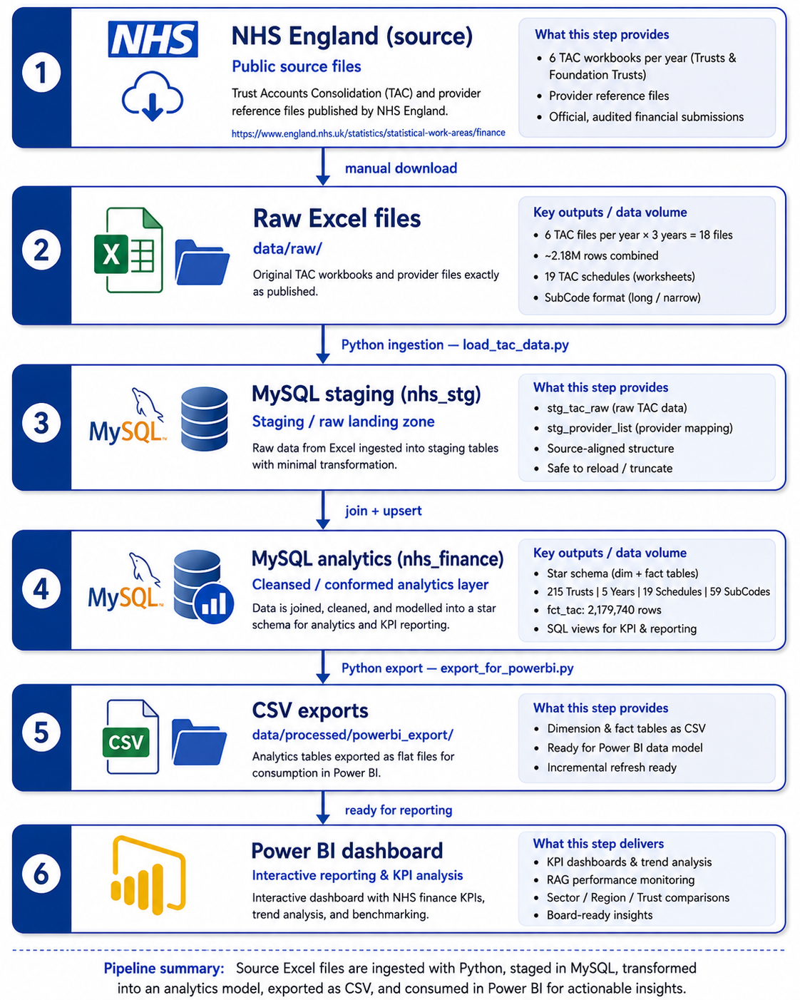

# NHS Trust Financial Analytics

> **The NHS sector moved from a £1.6bn surplus in 2021/22 to a £1.6bn deficit in 2023/24 — a £3.2bn swing in two years.**
> This project builds an end-to-end analytics pipeline to surface that story from raw NHS England public data.

---

## What this project is

An end-to-end financial analytics pipeline using **real NHS England Trust Accounts Consolidation (TAC) data**, covering **206 NHS Trusts and Foundation Trusts** across **three financial years (2021/22 – 2023/24)**.

It models the work of an NHS Trust finance analytics function: ingesting annual accounts data, computing sector KPIs against NHS FReM conventions, and producing board-ready outputs in Power BI.

**Why it exists:** NHS England already publishes this data — it just doesn't publish it in usable form. TAC data is released as six separate Excel workbooks a year, in a long/narrow SubCode format designed for archival completeness, not analysis. There is no consolidated, multi-year, trust-level view anywhere in the public data as published. Building one means combining six files across three years, resolving inconsistent formats between them, and pivoting a SubCode taxonomy that isn't self-explanatory without a data dictionary — and the numbers it surfaces describe a sector in genuine distress (see [Key findings](#key-findings) below).

**Objectives:**

1. Ingest and consolidate three years of published TAC data — six workbooks, 206 NHS organisations — into a single, queryable data warehouse
2. Build a reusable, idempotent pipeline that can absorb a new year's data without manual rework or risk of duplication
3. Compute the core NHS financial KPIs against NHS England's own published RAG thresholds, not an invented scoring system
4. Keep the data model auditable — every figure traceable back to the exact source file, TAC schedule, and SubCode it came from
5. Deliver the result as an interactive dashboard usable by a non-technical audience — a finance director or board — not just query output for another analyst

Full technical documentation, including the full business case, methodology, and stage-by-stage build notes: [PROJECT_DOCUMENTATION.md](PROJECT_DOCUMENTATION.md)

---

## The six-stage pipeline

Data moves in one direction only — source to dashboard — with each stage owned by a different technology:

<p align="center">

</p>

| Stage | What it does |
|-------|--------------|
| ① NHS England (source) | NHS England's annual TAC publication — audited Trust accounts, consolidated and published as public data |
| ② Raw Excel files | Six workbooks (~170MB) downloaded manually into `data/raw/` — a fixed, reproducible snapshot |
| ③ MySQL staging (`nhs_stg`) | `load_tac_data.py` lands the data close to verbatim — minimal transformation, full auditability |
| ④ MySQL analytics (`nhs_finance`) | Staging data resolved to ODS codes and upserted into a star schema; SQL views pivot SubCodes into KPI-ready tables |
| ⑤ CSV exports | `export_for_powerbi.py` writes 9 flat CSVs — portable, no database connection required |
| ⑥ Power BI dashboard | 5-page interactive report — the only stage a non-technical end user actually interacts with |

Full detail on each stage — including the schema, SQL, and design rationale — is in [PROJECT_DOCUMENTATION.md](PROJECT_DOCUMENTATION.md).

---

## Key findings

| Metric | 2021/22 | 2022/23 | 2023/24 |
|--------|---------|---------|---------|
| Total NHS income | £110.3bn | £118.4bn | £129.2bn |
| Total NHS expenditure | £108.7bn | £118.2bn | £130.8bn |
| Sector operating surplus / (deficit) | **+£1.6bn** | +£148m | **−£1.6bn** |
| Trusts in deficit | 37 of 211 | 85 of 207 | **124 of 206** |
| Average EBITDA margin | 4.6% | 4.3% | 3.6% |

**The headline:** Pay inflation following the 2023 Agenda for Change uplift, combined with clinical supply cost pressures, drove expenditure growth of 10.7% in 2023/24 against income growth of 9.1%. More than half of all NHS Trusts ended 2023/24 in deficit — the worst collective financial position since NHS provider finance reporting began in its current form.

---

## NHS domain coverage

This project applies real NHS finance conventions throughout:

| Convention | Implementation |
|-----------|----------------|
| NHS Financial Reporting Manual (FReM) | IFRS-aligned chart of accounts, SoCI structure |
| TAC worksheet mapping | TAC02 (I&E) · TAC08 (expenditure) · TAC09 (workforce) |
| NHS period labels | M01 (April) → M12 (March); financial year not calendar year |
| ODS organisation codes | 3-character provider codes (`org_code`) across all dimensions |
| Agenda for Change pay context | Pay as % of income KPI; WTE cost benchmarking |
| EBITDA margin RAG thresholds | ≥2% Green · 0–2% Amber · <0% Red (NHS England standard) |
| Financial year labelling | `YYYY/YY` (e.g. `2023/24`); no calendar-month grain — TAC is an annual return |

---

## Technical skills demonstrated

| Skill | Implementation |
|-------|---------------|
| Data engineering | Python pipeline ingesting 6 NHS Excel TAC files (~170MB) into MySQL |
| Dimensional modelling | Star schema: `dim_trust` · `dim_financial_year` · `dim_worksheet` · `dim_subcode` → `fct_tac` (2.18M rows) |
| SQL analytics | Analytical views for I&E, expenditure, workforce, KPIs, and sector scorecard |
| Data quality | 10-query validation suite with expected-value assertions |
| Financial KPIs | EBITDA margin · Pay % of income · Cost per WTE · Net surplus margin |
| Power BI | 9-CSV export pipeline · 51 DAX measures · 5-page dashboard |
| NHS domain knowledge | TAC subcode taxonomy · FReM conventions · sector benchmarks |

---

## Database schema

Two MySQL databases:

**`nhs_stg`** — staging layer

| Table | Description |
|-------|-------------|
| `stg_tac_raw` | Raw ingest from all 6 TAC Excel files |
| `stg_provider_list` | ODS provider reference |

**`nhs_finance`** — analytics layer

| Table / View | Rows | Description |
|---|---|---|
| `dim_trust` | 215 | Provider master — ODS code, sector, region, trust type |
| `fct_tac` | 2,179,740 | Fact table: one row per org / year / subcode / data type |
| `v_income_expenditure` | 624 | I&E per trust per year (SoCI — TAC02) |
| `v_expenditure_breakdown` | 624 | Pay / non-pay / drugs / depreciation split (TAC08) |
| `v_workforce` | 624 | Staff costs and WTE (TAC09) |
| `v_kpis` | 624 | Computed KPIs with RAG status |
| `v_trust_annual_scorecard` | 624 | Wide view combining all metrics |

---

## Project structure

```text
├── agent_docs/
│   ├── data_dictionary.md        # TAC subcode and column reference
│   ├── kpi_definitions.md        # KPI formulas, RAG thresholds, FReM alignment
│   └── report_calendar.md        # NHS period table and reporting cycle
│
├── data/                         # git-ignored — raw source and pipeline output, both regenerable
│   ├── raw/                      # NHS TAC Excel source files (~170MB)
│   └── processed/
│       └── powerbi_export/       # 9 CSVs ready for Power BI
│
├── docs/images/                  # Screenshots and diagrams used in PROJECT_DOCUMENTATION.md
│
├── python/
│   ├── ingestion/
│   │   └── load_tac_data.py            # Ingests all 6 TAC files into MySQL
│   ├── transformation/
│   │   ├── transform_tac_data.py       # Enrichment: sector flags, YoY, sector benchmarks
│   │   └── validate_tac_data.py        # Data-quality checks → validation_report.csv
│   └── reporting/
│       └── export_for_powerbi.py       # Exports MySQL views to 9 CSVs
│
├── sql/
│   ├── schema/
│   │   └── create_tables_mysql.sql       # Full schema DDL
│   ├── views/
│   │   ├── v_validation_checks.sql       # 10 data integrity checks
│   │   └── v_trust_annual_scorecard.sql  # Wide scorecard view (DirectQuery / ad-hoc SQL, not the CSV export)
│   └── analysis/
│       ├── sector_trend_analysis.sql     # Sector-level trend queries
│       └── benchmarking_analysis.sql     # Trust-level benchmarking queries
│
├── power_bi/
│   ├── setup_guide.md            # Model relationships, page specs
│   ├── dax_measures.md           # All 51 measures, human-readable
│   └── dax/_Measures.tmdl        # Exact Power BI Desktop export
│
├── reports/
│   └── nhs_sector_financial_review_2324.md  # Annual sector outturn narrative
│
└── notebook/                     # Stage-by-stage build notes kept while developing the pipeline
    └── stage_01…06_*.md          # One file per pipeline stage, ① through ⑥
```

Full tree, including every `CLAUDE.md`, is in `PROJECT_DOCUMENTATION.md` under "Repository Structure".

---

## Power BI outputs

| File | Rows | Purpose |
|------|------|---------|
| `dim_trust.csv` | 215 | Trust slicer — sector, region, trust type |
| `dim_financial_year.csv` | 5 | Year slicer |
| `kpis.csv` | 624 | KPI scorecards and scatter plots |
| `ie_summary.csv` | 624 | I&E waterfall and trend lines |
| `expenditure_breakdown.csv` | 624 | Pay vs non-pay breakdown |
| `workforce.csv` | 624 | WTE and staff cost analysis |
| `income_detail.csv` | 9,144 | Income drilldown by TAC line item |
| `expenditure_detail.csv` | 11,856 | Cost drilldown by TAC line item |
| `sector_benchmarks.csv` | 30 | Aggregated sector benchmarks |

---

## Reproduce from scratch

**Prerequisites:** Python 3.11+ · MySQL 8.0+ · NHS TAC Excel files in `data/raw/`

```bash
# 1. Create schema and seed dimensions
#    Run sql/schema/create_tables_mysql.sql in MySQL Workbench or DbVisualizer

# 2. Ingest all 6 NHS TAC files (~10 minutes)
python python/ingestion/load_tac_data.py

# 3. Validate the load
#    Run sql/views/v_validation_checks.sql — 10 queries with expected values

# 4. Export for Power BI
python python/reporting/export_for_powerbi.py
#    Writes 9 CSVs to data/processed/powerbi_export/

# 5. Build the dashboard
#    Follow power_bi/setup_guide.md
```

**Python dependencies:** `pandas` · `sqlalchemy` · `pymysql` · `openpyxl`

---

## Data notes

- Source: [NHS England TAC publications](https://www.england.nhs.uk/financial-accounting-reporting-systems/nhs-england-finance-returns-publications-guidance/trust-accounts-consolidation-tac/) — publicly available, updated annually
- Each annual file includes Prior Year (PY) rows; the pipeline retains Current Year (CY) only to prevent double-counting
- Total WTE (`STA0410`) is the reliable workforce metric; WTE by staff group has subcode ambiguity in the TAC format
- 2021/22 source files use slightly different column naming (`Organisation Name` with space; `Value number`) — handled in the ingestion layer

---

*For full technical documentation, NHS background, data model detail, and analytical narrative: [PROJECT_DOCUMENTATION.md](PROJECT_DOCUMENTATION.md)*
