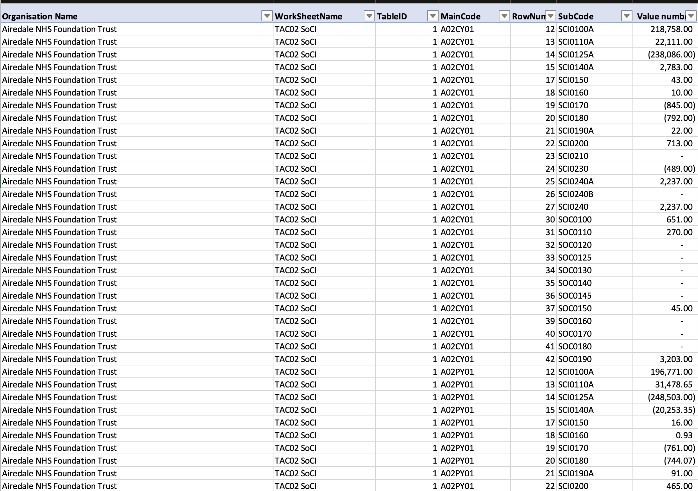

# Stage ② — Raw Excel Files

> This stage is about understanding the exact shape of the data before any code runs. The Python
> pipeline receives these files and has to deal with exactly what NHS England published — no cleaning,
> no reformatting, nothing assumed.

---

## The 6 Files

```text
data/raw/
  TAC_NHS_trusts_2021-22.xlsx             16MB  —  66 NHS Trusts
  TAC_NHS_foundation_trusts_2021-22.xlsx  33MB  — 140 Foundation Trusts
  TAC_NHS_trusts_2022-23.xlsx             20MB  —  66 NHS Trusts
  TAC_NHS_foundation_trusts_2022-23.xlsx  36MB  — 140 Foundation Trusts
  TAC_NHS_trusts_2023-24.xlsx             18MB  —  66 NHS Trusts
  TAC_NHS_foundation_trusts_2023-24.xlsx  38MB  — 140 Foundation Trusts
```

**Why 2 files per year?** NHS Trusts and Foundation Trusts are published separately. Same column
structure, different populations. The pipeline treats them identically — the filename tells the code
which type it is.

**Why are they large?** Long/narrow format — 10,000+ rows per trust. 66 trusts × ~7,000 rows ≈ 481,000
rows in an NHS Trusts file alone.

**The illustrative file** (`TAC_illustrative_2023-24.xlsx`) is a reference schema file showing every
SubCode and its description, not real trust data. The pipeline explicitly skips it:

```python
# python/ingestion/load_tac_data.py
files = sorted(
    p for p in RAW_DIR.glob("TAC_NHS_*.xlsx")
    if "illustrative" not in p.name.lower()
)
```

---

## Inside Each File: Two Sheets That Matter

### Sheet 1 — "List of Providers"

Small lookup table, one row per trust (66 or 140 rows).

| Column | Example |
| ------ | ------- |
| Full name of Provider | `Airedale NHS Foundation Trust` |
| NHS code | `RCF` |
| Authorisation date | `6/1/10` |
| Region | `North East and Yorkshire` |
| Sector | `Acute` |


**Purpose:** provides the ODS code for each trust by name. The "All data" sheet has names, not codes —
this sheet resolves that gap. The source also includes authorisation dates, but the current pipeline does
not load that field; it carries the provider name, ODS code, region, and sector into staging.

The pipeline keeps only rows where `org_code` is exactly 3 characters:

```python
df = df[df["org_code"].str.len() == 3]   # drops blank rows, header artefacts
```

### Sheet 2 — "All data"

The main data sheet: ~481,000 rows (NHS Trusts file) or ~1.1M rows (Foundation Trusts file), long/narrow,
exactly 7 columns. Each row is one reported amount: the trust and TAC schedule identify the context,
`TableID` and `MainCode` locate the source table and column, and `RowNumber` and `SubCode` identify the
line item.

| Source column | What it identifies | Example from the screenshot |
| ------------- | ------------------ | --------------------------- |
| `Organisation Name` | Trust reporting the figure | `Airedale NHS Foundation Trust` |
| `WorkSheetName` | TAC schedule | `TAC02 SoCI` |
| `TableID` | Table within that schedule | `1` |
| `MainCode` | Source column, including year type | `A02CY01` |
| `RowNumber` | Line position on the original form | `12` |
| `SubCode` | Financial line item | `SCI0100A` |
| `Value number` | Amount, in £000s | `218,758.00` |

Each row is one reported amount. The schedule and table show where it came from; `MainCode` identifies its
column; `RowNumber` and `SubCode` identify the line item. The value is in £000s.



In the first row, `Airedale NHS Foundation Trust` is the organisation, `TAC02 SoCI` is the schedule,
`TableID` is 1, and `A02CY01` identifies the current-year column. `RowNumber` 12 and `SubCode` `SCI0100A`
locate the patient-care-income line; `218,758.00` is its amount in £000s. The repeated `A02CY01` values
show that these rows belong to the same column, while their row numbers and SubCodes identify different
lines.

`MainCode` follows the pattern `A{schedule_number}{CY|PY}{column_number}[optional suffix]`. In
`A02CY01`, `A02` means schedule TAC02, `CY` means Current Year, and `01` means column 1. The trailing
number is a **column number**, not a table number; `TableID` stores the table separately. Some schedules
add a category suffix, such as `P` for permanent staff in `A09CY01P`.

In the original TAC table, `SubCode` labels the line and `MainCode` labels the value column; "All data"
flattens their intersection into one record. In the screenshot, `A02PY01` marks the prior-year comparison
column alongside `A02CY01`. Because this is the 2021/22 workbook, its PY values are for 2020/21. The
pipeline drops PY rows and keeps CY rows to avoid counting comparison years again when workbooks are
combined. The filter runs during [stage ③](stage_03_mysql_staging.md).

---

## A Key Inconsistency Across File Versions

NHS England changed column names between 2021/22 and later files:

| 2021/22 column name | 2022/23+ column name | What it is      |
|-----------------------|-----------------------|-------------------|
| `Organisation Name`   | `OrganisationName`   | Trust name        |
| `Value number`        | `Total`               | The £000s value   |

The pipeline handles this silently:

```python
col_map = {
    "Organisation Name": "OrganisationName",
    "Value number":      "Total",
    "Value Number":      "Total",
}
df = df.rename(columns=col_map)
```

Without this, pandas would produce a DataFrame with an unexpected column name and the pipeline would fail
with a missing-column error on the 2021/22 files specifically. This is a real-world data-engineering
problem: an external source changed format mid-series, and the pipeline has to absorb that transparently
rather than special-casing "the old files" by hand.

---

## What the Pipeline Reads from the Filename — Before Opening the File

Two critical facts live only in the filename, not inside the workbook:

```python
YEAR_RE = re.compile(r"(\d{4})-(\d{2})")

def filename_to_financial_year(filename: str) -> str:
    match = YEAR_RE.search(filename)
    return f"{match.group(1)}/{match.group(2)}"   # "2023-24" → "2023/24"

def filename_to_trust_type(filename: str) -> str:
    return "FOUNDATION_TRUST" if "foundation" in filename.lower() else "NHS_TRUST"
```

Both `financial_year` and `trust_type` are attached to every row of data as extra columns before anything
else happens. Rename a file and the pipeline mis-tags every row inside it — the exact filenames matter.

---

## Raw Data Quality Issues and How They're Handled

| Issue | How handled |
|-------|-------------|
| `Total` column arrives as float (Excel `NaN` for blanks) | Read as `float`, `fillna(0)`, cast to `int64` only after CY/PY filtering |
| Organisation names have trailing spaces | `.str.strip()` on every string column |
| Negative values in expenditure | Valid — stored as-is; sign convention follows TAC, not remapped |
| PY rows mixed with CY rows | Filtered on `main_code` containing `"PY"` before any row is written |

---

## Stage ② Summary

| What you see in the raw file              | What it means                                         |
|---------------------------------------------|----------------------------------------------------------|
| 2 sheets per file                           | "List of Providers" = lookup; "All data" = facts        |
| 7 columns in "All data"                     | Minimal structure to identify any line for any trust     |
| CY and PY rows mixed                        | Must filter to CY only across all six files              |
| Name in "All data", code in provider list   | A join is required to resolve ODS codes — see stage ③   |
| Column names differ in 2021/22              | Pipeline handles format changes silently                 |
| Total in £000s                              | Never divide or multiply here — store as-is              |

---

## Relevant Files

| File | What to Read |
|------|-------------|
| [data/raw/](../data/raw/) | Open any TAC `.xlsx` in Excel — examine both sheets directly |
| [agent_docs/data_dictionary.md](../agent_docs/data_dictionary.md) | Full SubCode reference, MainCode format, data-quality notes |
| [PROJECT_DOCUMENTATION.md](../PROJECT_DOCUMENTATION.md), stage ② | The narrative version, plus the "how I sourced the data" story |
| [python/ingestion/load_tac_data.py](../python/ingestion/load_tac_data.py) | `filename_to_financial_year()`, `filename_to_trust_type()`, `read_provider_list()`, `read_all_data()` |

---

*Previous: [Stage ① — NHS England (Source)](stage_01_nhs_england_source.md)*
*Next: [Stage ③ — MySQL Staging](stage_03_mysql_staging.md)*
