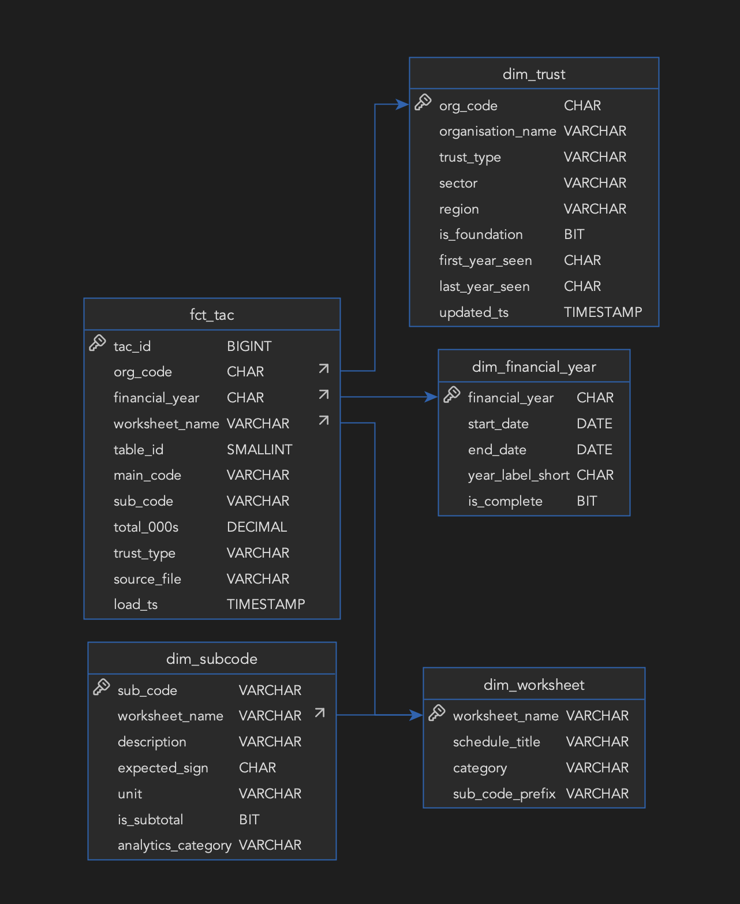

# Stage ④ — MySQL Analytics

> `nhs_finance` — populated by the same script's `promote_to_fact()` and `populate_dim_trust()`, then
> pivoted by five SQL views. This is where raw, EAV-shaped staging data becomes a conformed star schema,
> and where KPI-ready output actually gets computed.

---

## `populate_dim_trust()` — Slowly Changing Dimension, Type 1

```sql
INSERT INTO dim_trust (org_code, organisation_name, trust_type, sector, region, is_foundation,
                        first_year_seen, last_year_seen)
VALUES (...)
ON DUPLICATE KEY UPDATE
    last_year_seen = VALUES(last_year_seen),
    sector         = COALESCE(VALUES(sector), sector),
    region         = COALESCE(VALUES(region), region),
    updated_ts     = CURRENT_TIMESTAMP;
```

This overwrites rather than versions — a Type 1 SCD, not Type 2. Two deliberate asymmetries in what the
`UPDATE` clause touches:

- `last_year_seen` is always moved forward to the year currently loading
- `first_year_seen` is **not** in the `UPDATE` clause at all, so it's set once on first `INSERT` and never
  touched again — the pipeline's record of when a trust first entered the dataset
- `COALESCE(VALUES(sector), sector)` — if the incoming file has a null sector for some reason, the
  existing value is kept rather than overwritten with a blank

## `promote_to_fact()` — The Critical Join

**Step A — resolve `org_code` by joining staging against the provider list:**

```sql
SELECT p.org_code, r.*
FROM stg_tac_raw r
JOIN stg_provider_list p
    ON  r.organisation_name = p.organisation_name
   AND  r.financial_year    = p.financial_year
   AND  r.trust_type        = p.trust_type
WHERE r.financial_year = :fy AND r.trust_type = :tt
```

The join is on three columns to uniquely match a name within the same year and file type. Any name in
`stg_tac_raw` that doesn't match `stg_provider_list` is silently dropped here — which is exactly what
[stage ③](stage_03_mysql_staging.md)'s `validate()` warning about unmatched names is telling you will
happen.

**Step B — a self-healing step most walkthroughs of this pipeline miss:** before the join runs, every
distinct `worksheet_name` present in this file's staging rows is guaranteed to exist in `dim_worksheet`:

```python
for ws_name in stg_sheets["worksheet_name"]:
    conn.execute(text("""
        INSERT IGNORE INTO dim_worksheet (worksheet_name, schedule_title, category)
        VALUES (:ws, :ws, 'OTHER')
    """), {"ws": ws_name})
```

`dim_worksheet` is seeded with **19** properly-titled TAC schedules in the DDL (see below), but the real
files reference **30** distinct worksheet names across the three years. Rather than let the
`worksheet_name → dim_worksheet` foreign key on `fct_tac` reject a row the DDL author didn't happen to
seed, `promote_to_fact()` self-heals the dimension first: any worksheet name not already present gets
inserted with a placeholder title (its own name) and `category = 'OTHER'`, via `INSERT IGNORE` so it's a
no-op if the row already exists. This is a defensive pattern worth calling out on its own: a dimension
table doesn't have to be perfectly pre-seeded to be safe to enforce a foreign key against, provided the
promotion step is prepared to extend it.

**Step C — UPSERT into `fct_tac`, chunked:**

```python
for start in range(0, len(fact_df), 1000):
    chunk = fact_df.iloc[start: start + 1000]
    conn.execute(upsert_sql, chunk.to_dict(orient="records"))
```

```sql
INSERT INTO fct_tac (org_code, financial_year, worksheet_name, table_id,
                      main_code, sub_code, total_000s, trust_type, source_file)
VALUES (...)
ON DUPLICATE KEY UPDATE
    total_000s  = VALUES(total_000s),
    source_file = VALUES(source_file),
    load_ts     = CURRENT_TIMESTAMP;
```

Chunked because `to_sql()` — used for the simpler staging load — doesn't support
`ON DUPLICATE KEY UPDATE`; this uses parameterised SQL instead.

**Why UPSERT, not staging's delete-and-reload?** `fct_tac` and `dim_trust` aren't disposable per file —
they're the *accumulation* of all six files. A truncate-and-reload triggered by loading file 2 would wipe
out file 1's rows. The fix is a unique key that identifies "the same financial line item" regardless of
which run loaded it, so each file can only ever add or refresh its own rows:

```sql
UNIQUE KEY uq_tac (org_code, financial_year, main_code, sub_code)
```

Running the pipeline twice against the same file leaves `fct_tac` and `dim_trust` with identical row
counts both times.

---

## The Star Schema

<p align="center">

</p>

`fct_tac` is the centre — one row per `(org_code, financial_year, main_code, sub_code)`. Three enforced
foreign keys: `org_code → dim_trust`, `financial_year → dim_financial_year`, `worksheet_name →
dim_worksheet`. `sub_code` stays deliberately unconstrained: `dim_subcode` seeds only 59 key SubCodes out
of the thousands that actually appear across all 19+ TAC schedules, so a direct FK would block every
non-seeded line item from loading. `dim_subcode` itself carries the FK into `dim_worksheet`, so the
schedule-level relationship is still enforced — one join away, on a table 2.18 million rows smaller.

```sql
CREATE TABLE fct_tac (
    tac_id          BIGINT        AUTO_INCREMENT PRIMARY KEY,
    org_code        CHAR(3)       NOT NULL,
    financial_year  CHAR(7)       NOT NULL,
    worksheet_name  VARCHAR(50)   NOT NULL,
    table_id        SMALLINT      NOT NULL,
    main_code       VARCHAR(20)   NOT NULL,
    sub_code        VARCHAR(20)   NOT NULL,
    total_000s      DECIMAL(14,0) NOT NULL,
    trust_type      VARCHAR(20)   NOT NULL,
    source_file     VARCHAR(200)  NOT NULL,
    load_ts         TIMESTAMP     DEFAULT CURRENT_TIMESTAMP,
    UNIQUE KEY uq_tac (org_code, financial_year, main_code, sub_code),
    INDEX idx_fct_org_year  (org_code, financial_year),
    INDEX idx_fct_sub_code  (sub_code),
    INDEX idx_fct_worksheet (worksheet_name),
    INDEX idx_fct_year      (financial_year),
    FOREIGN KEY (org_code)       REFERENCES dim_trust(org_code),
    FOREIGN KEY (financial_year) REFERENCES dim_financial_year(financial_year),
    FOREIGN KEY (worksheet_name) REFERENCES dim_worksheet(worksheet_name)
) ENGINE=InnoDB;
```

The live database was missing the third FK for a period during development — the DDL script always
declared it, but the deployed table didn't have it. I checked for orphaned `worksheet_name` values first
(none), then added it directly with `ALTER TABLE ... ADD CONSTRAINT`. Full story, including the
`SHOW CREATE TABLE` verification, is in `PROJECT_DOCUMENTATION.md`, stage ④.

### `dim_subcode` — the dimension that drives every view

```sql
CREATE TABLE dim_subcode (
    sub_code            VARCHAR(20)  PRIMARY KEY,
    worksheet_name      VARCHAR(50)  NOT NULL,
    description         VARCHAR(300) NOT NULL,
    expected_sign       CHAR(3),
    unit                VARCHAR(10)  DEFAULT '£000',
    is_subtotal         TINYINT(1)   NOT NULL DEFAULT 0,
    analytics_category  VARCHAR(30),   -- PAY | NON_PAY | NON_PAY_EXCL_EBITDA | ...
    FOREIGN KEY (worksheet_name) REFERENCES dim_worksheet(worksheet_name)
) ENGINE=InnoDB;
```

`analytics_category` is what lets `v_expenditure_breakdown` (below) sum by category without hardcoding a
SubCode list — tag once in the dimension, every view benefits. `is_subtotal` flags summary rows (e.g. a
"total patient care income" line) so detail exports can exclude them and avoid double-counting.

---

## Analytics Layer — The Five SQL Views

`fct_tac` is correct once loaded, but it's still 2.18 million individual SubCode rows — not something a
dashboard can chart. Five views pivot it into trust-level, year-level tables.

**`v_income_expenditure`** — pivots TAC02 SoCI SubCodes into an I&E summary row per trust per year:

```sql
SELECT
    org_code, financial_year,
    MAX(CASE WHEN sub_code = 'SCI0100A' THEN total_000s END) AS patient_care_income_000s,
    MAX(CASE WHEN sub_code = 'SCI0140A' THEN total_000s END) AS operating_surplus_000s,
    MAX(CASE WHEN sub_code = 'SCI0240'  THEN total_000s END) AS net_surplus_000s
FROM fct_tac
WHERE worksheet_name = 'TAC02 SoCI'
GROUP BY org_code, financial_year;
```

**`v_expenditure_breakdown`** — pivots TAC08 using `dim_subcode.analytics_category`, not a hardcoded list:

```sql
SUM(CASE WHEN sc.analytics_category = 'PAY'     THEN f.total_000s END) AS pay_000s,
SUM(CASE WHEN sc.analytics_category = 'NON_PAY' THEN f.total_000s END) AS non_pay_000s
```

**`v_workforce`** — pivots TAC09 into staff cost and WTE columns.

**`v_kpis`** — joins the three views above, computes the derived metrics:

```sql
operating_surplus_000s + COALESCE(depreciation_amort_000s, 0)     AS ebitda_000s
ROUND(ebitda_000s / NULLIF(total_income_000s, 0) * 100, 1)        AS ebitda_margin_pct
ROUND(pay_000s / NULLIF(total_income_000s, 0) * 100, 1)           AS pay_pct_income
ROUND(staff_cost_000s / NULLIF(total_wte, 0), 1)                  AS cost_per_wte_000s
```

**`v_trust_annual_scorecard`** — a wide, one-row-per-trust-per-year view combining all of the above,
built for DirectQuery and ad-hoc SQL (see `sql/analysis/`), not the CSV export — the export in
[stage ⑤](stage_05_csv_exports.md) queries the four narrower views separately instead.

---

## Stage ④ Summary

| Concept | Design Decision | Why |
|---------|------------------|-----|
| `ON DUPLICATE KEY UPDATE` on `fct_tac` / `dim_trust` | UPSERT, not delete-and-reload | Both tables accumulate across all six files |
| Self-healing `dim_worksheet` | `INSERT IGNORE` before the join | The FK must never block a row for an under-seeded dimension |
| No FK from `fct_tac` to `dim_subcode` | Only 59 of thousands of SubCodes are seeded | Enforced one join away instead, on a much smaller table |
| `MAX(CASE WHEN sub_code = ... )` pivot idiom | Every `v_*` view | Turns EAV rows into named columns without changing the fact table |
| `analytics_category` on `dim_subcode` | Tag once, every view benefits | Avoids hardcoded SubCode lists inside view SQL |

---

## Relevant Files

| File | What to Read |
|------|-------------|
| [python/ingestion/load_tac_data.py](../python/ingestion/load_tac_data.py) | `populate_dim_trust()`, `promote_to_fact()` |
| [sql/schema/create_tables_mysql.sql](../sql/schema/create_tables_mysql.sql) | Full dimension + fact DDL |
| [sql/views/](../sql/views/) | Standalone, canonical version of every `v_*` view |
| [sql/CLAUDE.md](../sql/CLAUDE.md) | Naming conventions, view standards, query style |
| [PROJECT_DOCUMENTATION.md](../PROJECT_DOCUMENTATION.md), stage ④ | The narrative version, the FK-fix story, the KPI write-ups, and the key findings |

---

*Previous: [Stage ③ — MySQL Staging](stage_03_mysql_staging.md)*
*Next: [Stage ⑤ — CSV Exports](stage_05_csv_exports.md)*
